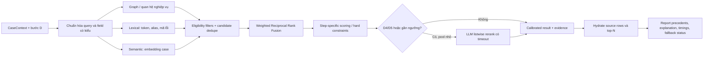

# GraphAI — Kế hoạch nâng cấp truy hồi tiền lệ 8D

**Mục đích:** định hướng nâng cấp retrieval để kết quả đúng cơ chế lỗi/hành động hơn và phản hồi nhanh trên dữ liệu nhóm tự định nghĩa, seed sẵn trong repo.  
**Ràng buộc:** không phụ thuộc SAP HANA Cloud, dịch vụ graph cloud, hoặc phải có database graph riêng. Ưu tiên chạy trên SQLite hiện có; giữ đường tương thích PostgreSQL nếu nhóm cần.  
**Trạng thái tài liệu:** đề xuất thiết kế; chưa phải thay đổi đã triển khai.

## 1. Kết luận kiến trúc

**Không cần viết lại toàn bộ graph retrieval chỉ vì code hiện tại “đơn giản”. Cần thay phần truy hồi đang chạy trên SQLite và hiện đại hóa pipeline theo hướng hybrid, có đánh giá định lượng.** Graph logic hiện tại không hẳn sơ sài: nó đã có quan hệ theo miền nghiệp vụ, profile riêng D1–D8, nguồn giải thích được, loại case đóng, lọc case đang mở và fallback. Điểm cần cải thiện là cách kết hợp các tín hiệu, khả năng chạy độc lập trên bộ dữ liệu local, đánh giá chất lượng xếp hạng và hiệu năng khi dữ liệu lớn dần.

### Phát hiện quan trọng từ source hiện tại

- `srv/src/domain/eightd/graph/engine.ts` gọi `isGraphAvailable()` trước khi chạy graph. `graphClient.ts` trả `false` nếu `db.kind` không phải HANA. Vì vậy, với cấu hình SQLite local được README hướng dẫn, lời gọi `findPrecedents()` quay về `findPrecedentsByStepScoring()`; graph engine trong `graph/` không phải đường chạy hiện tại trên SQLite.
- Graph HANA hiện là một **candidate retriever theo quan hệ có cấu trúc**: các probe dò cùng work center, material, material family, defect code, keyword và action type. Chúng gom bằng chứng thành điểm có trọng số theo bước D. Đây là structural/exact retrieval, chưa phải hybrid giữa graph + lexical rank + semantic rank trong cùng pipeline.
- Các mặc định `rerank.weight` trong `graph/stepProfiles.ts` hiện bằng 0. Tầng rerank có sẵn nhưng không hoạt động nếu chưa bật profile; bật rerank không thay cho candidate retrieval tốt.
- Engine cũ đã có một phần lexical/field-based scoring, cosine embedding và listwise LLM rerank qua `precedent/scoring.ts`, `findPrecedents.ts`, `searchText.ts`, `pgvectorBridge.ts`, `reranker.ts`. Có thể tái sử dụng hợp đồng dữ liệu và một số module thay vì làm hai hệ ranking song song.
- Bộ test hiện có unit tests cho graph; `graph.integration.test.ts` đòi HANA và bị skip nếu không bật biến môi trường. Eval ở `srv/src/domain/eval/` chủ yếu chấm chất lượng báo cáo 8D, chưa phải một gold benchmark xếp hạng tiền lệ theo từng D.
- Bộ 25 case clean và 25 bản dirty là dữ liệu hữu ích để kiểm tra độ bền khi đầu vào lộn xộn. Chúng **không tự động tạo thành nhãn “case tiền lệ đúng”**; cần nhóm gán nhãn relevance cho truy vấn và bước D cụ thể.

Hệ quả: thay graph bằng một graph database mới không tự làm retrieval thông minh hơn. Cần một adapter local để xây/chạy quan hệ từ dữ liệu hiện có, thêm kênh tìm kiếm ngữ nghĩa và đánh giá nó trên gold labels.

## 2. Mục tiêu và nguyên tắc thiết kế

### Mục tiêu

1. Tìm được case cùng **cơ chế hỏng**, không chỉ cùng từ khóa/work center.
2. Tìm được hành động có khả năng chuyển giao đúng câu hỏi nghiệp vụ: D3 containment, D5 corrective, D6 evidence, D7 systemic prevention.
3. Giữ truy hồi giải thích được: kết quả phải nêu nguồn, quan hệ/đặc tính khớp, vì sao có ích cho bước đó và dữ kiện khác nhau.
4. Chạy được offline/local với SQLite và seed data; không cần SAP HANA Cloud hay dịch vụ graph riêng.
5. Tăng chất lượng mà không đổi độ trễ/call model một cách không kiểm soát; đo cả chất lượng, tốc độ, ổn định và chi phí.

### Không làm

- Không biến bài toán thành GraphRAG hỏi đáp tổng quát, community detection, graph-agent hoặc LLM tự viết truy vấn graph. Dữ liệu nhỏ, có cấu trúc rõ; đây là bài toán xếp hạng case 8D.
- Không tin một điểm cosine, một từ chung hoặc một cạnh bất kỳ là bằng chứng đủ để khẳng định hai lỗi cùng nguyên nhân.
- Không đưa dữ kiện định lượng (giá trị đo, giới hạn, đơn vị, số lượng, thời gian) vào embedding rồi để vector quyết định khớp. Các dữ kiện này phải so theo field có kiểu và nguồn.
- Không dùng LLM rerank cho toàn bộ kho hoặc cả tám discipline theo mặc định. Rerank đắt hơn, có timeout và không thay thế nhãn relevance.
- Không chọn HNSW/ANN chỉ vì đang phổ biến. Với vài chục đến vài nghìn case, quét vector chính xác trên tập lọc có thể đơn giản và nhanh hơn. Chỉ thêm ANN khi benchmark trên dữ liệu thật cho thấy cần.

## 3. Kiến trúc đích: Local Hybrid Case Retrieval

Đề xuất pipeline nhiều tầng: loại bỏ dữ liệu không hợp lệ → tạo query frame theo D → truy hồi candidate từ nhiều tín hiệu → hợp nhất thứ hạng → rerank một pool nhỏ khi đáng giá → tạo giải thích có provenance → trả top-N hoặc abstain.



### Bước 1 — Chuẩn hóa query theo discipline

Thêm một hàm thuần, chẳng hạn `buildRetrievalQuery(context, stepCode)`, trả về frame đã tách trường thay vì một chuỗi chung:

```ts
interface RetrievalQuery {
  stepCode: StepCode;
  exact: { materialId?: string; materialFamily?: string; workCenterId?: string; defectCode?: string };
  symptomText: string;
  mechanismText?: string;
  actionText?: string;
  verificationText?: string;
  keywords: string[];
  missingFields: string[];
}
```

Mỗi D chỉ dùng phần dữ kiện sẵn có:

| Bước | Câu hỏi retrieval | Tín hiệu ưu tiên | Tín hiệu chỉ hỗ trợ |
|---|---|---|---|
| D1 | Đội/ năng lực nào từng xử lý tình huống tương tự? | work center, material family, vai trò/kỹ năng; lịch sử team đã đóng | symptom/defect keyword |
| D2 | Ranh giới lỗi và đặc tính đo có giống hoặc đối lập hữu ích? | defect code, characteristic/measurement có đơn vị và spec được so bằng field | vật tư, mô tả symptom |
| D3 | Exposure hiện tại nào cần được containment? | số lượng/vị trí lô, exposure, loại containment đã dùng | symptom, work center |
| D4 | Cơ chế hỏng vật lý có giống không? | root cause/mechanism và evidence; semantic text của Ishikawa/5-Why | keyword, material family, work center |
| D5 | Biện pháp nào gỡ đúng nguyên nhân gốc? | nguyên nhân D4 ↔ corrective action relationship | family, symptom |
| D6 | Bằng chứng nào xác nhận hiệu quả? | characteristic/method/sample/acceptance criteria có kiểu | action/root-cause context |
| D7 | Bài học nào cần mở rộng ra nơi khác? | material family, mechanism, FMEA/process scope, preventive action | work center không được là điều kiện bắt buộc |
| D8 | Case nào có bài học/closure phù hợp? | closure completeness, lesson learned, successful action | overall context |

Thiếu mechanism/evidence ở D4 thì query phải ghi `missingFields`; không giả định nguyên nhân từ symptom. Cho phép kết quả `insufficient_query` thay vì giảm ngưỡng đến mức kéo case yếu vào.

### Bước 2 — Xây graph local từ dữ liệu seed sẵn

Không cần graph service ngoài. Xây projection nhỏ, xác định từ schema và case library đang có:

```text
Case --OCCURRED_AT--> WorkCenter
Case --ON_MATERIAL--> Material --IN_FAMILY--> MaterialFamily
Case --HAS_DEFECT--> DefectCode
Case --MENTIONS--> Keyword / FailureMechanism (curated mapping)
Case --RESOLVED_BY--> Action --HAS_ACTION_TYPE--> Containment | Corrective | Preventive
Case --HAS_ROOT_CAUSE--> RootCauseCategory / curated mechanism
Case --REFERENCES--> FMEA / inspection characteristic (khi dữ liệu có)
```

**Cách chạy giai đoạn đầu:** nạp các case đã seed qua CAP repository, dựng adjacency maps trong TypeScript (`nodeToCaseIds`, `caseToNodes`, `actionByCase`, `mechanismByCase`). Đây là projection in-memory thuần, dễ test cùng SQLite, không đổi database engine và đủ nhanh cho kho nhỏ.

**Nếu quy mô tăng:** lưu projection vào các bảng quan hệ chuẩn trong SQLite/PostgreSQL (`HistoricalCaseFeatures`, `HistoricalCaseRelations`) với khóa/index; cập nhật trong cùng transaction khi seed hoặc ghi closed case. Không lưu graph database thứ hai nếu các join SQL/index hiện tại đã đáp ứng được.

Ràng buộc projection:

- ID ổn định, quan hệ có `sourceType`, `sourceId`, `observedAt`, `confidence/provenance` nếu là alias suy ra; phân biệt quan hệ nhập từ dữ liệu với mapping được nhóm định nghĩa.
- `closed/Completed` và `notificationId != current` là **hard filters** trước xếp hạng. Case thiếu root-cause evidence không được đánh dấu là gold precedent cho D4 chỉ vì đã đóng.
- Dùng đường đi có giới hạn, thường 1–2 hop theo query profile. Tránh traversal tùy ý, path explosion và tính similarity chỉ bằng độ lớn degree.
- Chuẩn hóa ID/mã không xóa dấu gạch hoặc số có ý nghĩa nếu làm thay đổi mã lỗi/vật tư. So chính xác ID qua field; normalize ngôn ngữ riêng khỏi identity.
- Khi thêm/cập nhật case đã đóng, rebuild/invalidate phần projection tương ứng theo version. Không để adjacency cache cũ dùng sau khi library write-back.

### Bước 3 — Thêm các candidate channel độc lập

1. **Graph/field channel:** reuse quan hệ đang có (work center, vật tư/family, defect code, hành động, team); gom dữ kiện một lượt cho cả tám D thay vì mỗi D chạy lại 5–8 truy vấn. Tách score theo từng loại cạnh và đường đi.
2. **Lexical channel:** BM25/FTS trên `searchText` khi SQLite build có FTS5; fallback deterministic ở TypeScript (BM25/token overlap trên inverted index trong RAM) nếu không có FTS5. Dùng curated synonym/alias map cho thuật ngữ sản xuất, abbreviation, lỗi viết và ngôn ngữ trong dataset. Exact IDs vẫn được xử lý bằng channel riêng.
3. **Semantic channel:** dùng embedding provider và `buildSearchText()` hiện có để so phần văn bản kỹ thuật, nhưng bảo đảm cùng model/version, cùng cách ghép query/document, bắt degenerate vector và bỏ qua vector thiếu/khác model. Với bộ nhỏ, tính exact cosine trên các case đã lọc; tái dùng embedding đã lưu trong `HistoricalCases` nếu hợp lệ. Không gọi embedding cho mỗi case trong mỗi truy vấn.
4. **Action channel:** với D3/D5/D7 tìm candidate có hành động đúng `actionType`, sau đó so actionText với query mục tiêu. Không để một action containment làm precedent khắc phục vĩnh viễn.

Mỗi channel trả `caseId`, `rank`, raw score của chính kênh đó, `evidence[]`, elapsed time và trạng thái thiếu/lỗi. Không so trực tiếp cosine, BM25, graph points và LLM score như cùng một thang.

### Bước 4 — Hợp nhất ranking, sau đó áp quy tắc nghiệp vụ

Áp dụng Weighted Reciprocal Rank Fusion (WRRF) cho danh sách candidate của các channel:

```text
WRRF(case) = Σ channelWeight / (rrfConstant + rankInChannel(case))
```

Nếu case không có trong một channel, channel đó không đóng góp. Thứ hạng từng nguồn được hợp nhất, tránh cộng raw score không cùng thang. Sau RRF:

- Áp **hard rules**: case đóng; khác case hiện tại; đúng action type; có nội dung/evidence tối thiểu theo D. Hard rule loại case, không phải trừ vài điểm.
- Tính **step-specific reranker features**: đường graph, exact identity, keyword/BM25, semantic similarity, evidence completeness, successful action/closure, recency nếu dữ liệu thời gian đủ tốt.
- Chuẩn hóa/hiệu chỉnh các đặc trưng trên held-out validation set; ban đầu dùng rule/linear weighted model có giải thích, chưa huấn luyện model ML khi nhãn còn ít.
- Cho phép `no_match`/`low_evidence`: chỉ hiện precedent khi qua floor đã hiệu chuẩn cho D đó. Hiển thị lý do “không đủ bằng chứng” và những trường query bị thiếu.
- Giữ output contract `PerStepPrecedents`, `PrecedentResult`, `Precedent` của `findPrecedents.ts` để không phải viết lại analyzer/UI cùng lúc.

WRRF là điểm khởi đầu, không phải lựa chọn mặc định thắng mọi thứ: so nó với linear score hiện tại và weighted fusion bằng ablation trên gold set trước khi chuyển thành default. Tài liệu Neo4j mô tả cùng nguyên tắc rank các nguồn độc lập khi kết hợp lexical/vector; nghiên cứu RRF gốc cũng là một phương án fusion đơn giản được đánh giá cho retrieval. [Neo4j hybrid-search guide](https://neo4j.com/developer/genai-ecosystem/hybrid-search/), [Cormack et al. 2009](https://plg.uwaterloo.ca/~gvcormac/cormacksigir09-rrf.pdf).

### Bước 5 — Rerank có chọn lọc, bảo vệ latency

- Chỉ bật LLM listwise rerank khi câu hỏi thật sự cần đọc đồng thời hai case (ưu tiên D4 cơ chế hỏng, D5 corrective action; thử D3/D7 nếu nhãn chứng minh cải thiện).
- Mặc định lấy 8–12 ứng viên sau fusion; chỉ tăng tối đa 20 nếu Recall@candidate pool cho thấy đang bỏ gold case. Đặt timeout theo p95 thực tế; timeout/error giữ fusion order và ghi `rerankSkippedReason`.
- LLM chỉ được sắp thứ tự các `notificationId` trong candidate pool. Validate ID subset, unique ID, score range, duplicate/missing IDs; candidate do model tự sinh bị loại. Không cho reranker kéo case vi phạm hard filter trở lại.
- Model score dùng như ranking signal sau khi đo độ ổn định; nó không tự tạo ground-truth relevance và không thay graph/lexical evidence.
- Thực hiện rerank D4/D5 từng query step, không gọi 8 lần nếu profile/ứng viên giống nhau. Cân nhắc parallel calls chỉ sau khi kiểm soát giới hạn provider và DB pool.
- Có circuit breaker ngắn cho provider lỗi lặp lại; cache rerank theo hash query+candidate IDs+model+prompt version nếu request lặp; invalidate khi nội dung case, model hay rubric thay đổi.

Rerank đa ngôn ngữ là một lựa chọn nghiên cứu về sau (late interaction như ColBERT/Jina-ColBERT) nếu lexical+dense không bắt được paraphrase kỹ thuật và số lượng case lớn. Không triển khai vội: cần index riêng, nhiều vector/token và vận hành thêm; với kho hiện tại, LLM rerank pool nhỏ là đường ít thay đổi hơn. [ColBERTv2 paper](https://aclanthology.org/2022.naacl-main.272/), [Jina-ColBERT-v2 paper](https://aclanthology.org/2024.mrl-1.11/).

## 4. Kế hoạch chất lượng: tạo gold retrieval set trước khi tune

### Dataset/annotation

Tạo `mock-data/retrieval-eval/` với query–step–relevant precedent judgments. Bắt đầu từ các case có sẵn nhưng để **người am hiểu quy trình** gán nhãn độc lập:

```json
{
  "queryCaseId": "8D-...",
  "step": "D4",
  "judgments": [
    { "precedentCaseId": "8D-...", "relevance": 3, "reason": "Cùng cơ chế mòn clamp, có đo kiểm xác nhận" },
    { "precedentCaseId": "8D-...", "relevance": 0, "reason": "Cùng work center nhưng cơ chế khác" }
  ]
}
```

Thang relevance có thứ tự, ví dụ `0=không liên quan`, `1=cùng symptom/attribute`, `2=hữu ích cho bước`, `3=cùng mechanism hoặc action chuyển giao trực tiếp`. Mỗi nhãn có lý do/nguồn. Tách train/tune queries và holdout cases theo cặp case/twin để clean/dirty của cùng một sự thật không lọt cả hai tập và tạo leakage.

Bao gồm tối thiểu các lát cắt:

- cùng keyword nhưng khác mechanism (hard negative, như các case “flange”);
- khác từ nhưng cùng mechanism/action (semantic positive);
- cùng work center nhưng root cause khác;
- D7 cùng material family ở work center khác;
- clean/dirty pair và dữ liệu thiếu/mâu thuẫn;
- no-precedent query, để đo retrieval có dám trả rỗng;
- trường hợp mã lỗi/vật tư exact cần thắng semantic gần nhưng sai.

25 case chỉ tạo số lượng query–candidate ít; xem kết quả là benchmark nội bộ ban đầu, không tuyên bố năng lực tổng quát. Bổ sung case mới thật/ẩn danh hoặc synthetic được gắn nhãn và phân loại nguồn rõ ràng.

### Chỉ số bắt buộc và guardrails

**Quality:** Recall@5/10 (gold precedent có lọt vào pool/top-K), Precision@3, MRR@10 (vị trí kết quả liên quan đầu tiên), nDCG@5 (relevance có mức độ), coverage/no-result rate, false-positive rate ở no-precedent/hard-negative queries, hard-filter violation count (phải 0). MRR/nDCG phù hợp để xem ranking khi relevance có mức độ; [EACL 2026 RAG evaluation survey](https://aclanthology.org/2026.eacl-long.391.pdf).

**Speed/operability:** median/p95 end-to-end retrieval latency và theo channel; số DB queries; thời gian build/rebuild index; tỷ lệ embedding/rerank timeout; số candidate trước/sau mỗi tầng; chi phí/model calls mỗi case. Báo riêng warm/cold start và fallback.

**Human usefulness:** domain reviewer đánh dấu top-3 “dùng được/không dùng được” cho D4/D5/D7 và lý do; đếm tỷ lệ không có đủ evidence/abstain đúng. Không dùng LLM làm judge duy nhất. Nếu dùng LLM hỗ trợ pre-labeling, reviewer người phải xác nhận nhãn.

**Ablation phải so cùng holdout set:**

| Bản | Channels | Dùng để kiểm tra |
|---|---|---|
| A | Scoring hiện tại | Baseline chính |
| B | Local graph/field only | Structural relations có đóng góp gì |
| C | Lexical + exact fields | Từ khóa/alias có giúp paraphrase/typo không |
| D | Semantic + exact filters | Embedding thêm recall nào, có làm tăng false positives không |
| E | Graph + lexical + semantic + WRRF, không LLM | Giá trị của hybrid/fusion |
| F | E + rerank chọn lọc D4/D5 | Chất lượng tăng có đáng latency/cost không |

**Promotion gate gợi ý trước khi bật hybrid làm default:** Recall@10 của candidate pool không giảm so với baseline; nDCG@5 hoặc MRR@10 tăng hơn dao động giữa lần chạy; hard-filter violation = 0; no-precedent false-positive không xấu đi; p95 nằm trong mục tiêu nhóm chốt theo demo/UX. Số ngưỡng cụ thể cần định nghĩa sau baseline, không bịa sẵn.

## 5. Thiết kế performance và cache

Với dataset seed nhỏ, ưu tiên giảm round trip/model calls trước khi thêm thuật toán ANN:

1. **Một lần lấy cấu trúc:** gom relation features cho case library/query bằng batch SQL/repository hoặc snapshot index; tránh mỗi candidate lại query actions/team.
2. **Inverted index trong bộ nhớ:** `featureKey → set(caseId)` cho work center/material family/defect code/action type/token; các query exact O(1)-ish theo bucket, giao/hợp tập nhanh; sắp IDs deterministic.
3. **Vector exact scan trên subset:** cache embedding theo `(caseId, embeddingModel, searchTextHash)`; query embedding một lần/query. Tránh index ANN ở quy mô hiện tại nếu exact scan đạt latency mục tiêu.
4. **Candidate cap sớm:** mỗi channel lấy bounded K; dùng rank fusion; chỉ hydrate full precedent rows cho top-N cuối cùng.
5. **Cache đúng vòng đời:** config/profile cache giữ như hiện tại; retrieval cache key gồm normalized query, D-step, library version, profile version, embedding model, reranker prompt version. Invalidate theo closed case write-back/seed/đổi config; không cache chỉ theo `notificationId` nếu dữ liệu case chỉnh được.
6. **DB indexes:** kiểm tra EXPLAIN/SQLite query plan trên các trường lọc/foreign keys; tạo index đúng những join thường chạy, không index tất cả cột. Với dữ liệu nhỏ benchmark cả hai.
7. **Chỉ thêm pgvector HNSW ở giai đoạn scale:** khi tập vector đủ lớn và đo thấy exact cosine là bottleneck. Sau đó tune ef_search/recall và filter behavior; HNSW đổi tốc độ lấy neighbor lấy khả năng nhớ lại, nên cần đo trade-off. Tài liệu pgvector mô tả HNSW/IVFFlat, iterative scans, recall và `EXPLAIN (ANALYZE, BUFFERS)`. [pgvector README](https://github.com/pgvector/pgvector/blob/master/README.md).

## 6. Giải thích kết quả và hợp đồng dữ liệu

Mở rộng `PrecedentResult`/`Precedent` theo hướng tương thích ngược:

```ts
interface RetrievalTrace {
  engine: 'local-hybrid' | 'legacy-scoring' | 'fallback';
  channels: Array<{ name: string; status: 'ok' | 'skipped' | 'error'; ms: number; candidates: number }>;
  fusedRank: number;
  reranked: boolean;
  rerankSkippedReason?: string;
  libraryVersion: string;
}

interface EvidenceItem {
  type: string;              // materialFamily | defectCode | keyword | mechanism | action...
  relationPath?: string[];   // Case -> Material -> Family
  sourceCaseId: string;
  sourceField?: string;      // HistoricalCases.rootCauseCategory, HistoricalActions.actionText...
  matchedValue?: string;
  scoreContribution?: number;
  explanation: string;
}
```

UI explanation phải cụ thể: “Cùng họ vật tư MG-HOUSING; 2 token mechanism trùng; case đã đóng; hành động corrective liên kết với root cause Machine.” Nếu chỉ cùng work center, ghi “cùng trạm, nhưng khác mechanism” và hạ relevance D4. Nếu semantic channel trả kết quả nhưng không có bằng chứng miền đủ mạnh, hiển thị là ứng viên tham khảo hoặc loại theo floor; không trình bày như xác nhận nguyên nhân.

Log/trace không lưu raw dữ liệu khách hàng/PII không cần thiết. Ghi `traceId`, engine/version, timings, candidate counts, IDs, evidence refs, lý do fallback. Thông tin chi tiết chỉ lưu theo chính sách dataset.

## 7. Lộ trình triển khai theo pha

| Pha | Thay đổi | File/khu vực chính | Gate trước khi sang pha sau |
|---|---|---|---|
| **0 — Đo hiện trạng** | Xác nhận runtime thật; log engine hiện dùng SQLite; chạy baseline query/latency; lập 15–30 query có judgments đầu tiên; phân loại case synthetic/real | `engine.ts`, `eval/`, `mock-data/`, `scripts/` | Biết đường chạy, metrics baseline, biết ít nhất 5 lỗi ranking cụ thể |
| **1 — Local graph adapter** | Tạo interface `PrecedentRetriever`; implementation local relational/in-memory adjacency từ HistoricalCases/Actions; giữ hard filters; gom feature collection một lượt cho D1–D8 | `graph/localGraphIndex.ts` (mới), `graph/engine.ts`, repository, `closedCaseWriteBack.ts` | Chạy SQLite; evidence trace tái lập; output contract không đổi; unit tests không cần HANA |
| **2 — Hybrid candidate generation** | Thêm lexical BM25/FTS (nếu khả dụng), semantic exact-cosine channel trên stored embeddings, action channel; fusion WRRF; no-result floor | `precedent/lexicalRetriever.ts`, `semanticRetriever.ts`, `fusion.ts`, `engine.ts` | Đạt gate quality trên holdout; hard negatives/no-precedent không tạo false precedent; p95 trong target |
| **3 — Rerank có chọn lọc** | Bật thử D4/D5 trên pool nhỏ; output validation, timeout, failure isolation, optional cache | `precedent/reranker.ts`, `graph/stepProfiles.ts`, runtime config | Improvement vượt noise; p95/cost chấp nhận được; fallback giữ thứ hạng hybrid |
| **4 — Shadow/canary rồi promote** | Chạy baseline và local-hybrid cùng input; lưu so sánh top-K/delta/latency; cho reviewer accept/reject; bật làm default qua feature flag | `scripts/shadow-retrieval.mjs`, settings, eval report | Không hồi quy guardrails; người review thấy top-3 hữu ích hơn; bật/tắt không migrate/rewrite dữ liệu |
| **5 — Scale có điều kiện** | Chỉ nếu dataset tăng đáng kể: persist feature graph/index; optional pgvector HNSW/late interaction; benchmark refresh, recall, concurrency | DB adapters / migrations | Bottleneck được đo và ANN/scale path cải thiện SLA mà không phá recall |

### Thay đổi cụ thể trong entrypoint

Hiện `findPrecedents()` quyết định engine bằng `isGraphAvailable()` phụ thuộc HANA. Đề xuất thay dần bằng abstraction không gắn nhà cung cấp:

```text
findPrecedents()
  → getRetrievalSettings()
  → choose local-hybrid | legacy-scoring (feature flag / rollout)
  → result includes engineUsed + traces + fallback reason
```

`local-hybrid` đọc case library qua CAP service/repository trên SQLite; không gọi `isGraphAvailable()` như điều kiện bắt buộc. Các `.hdbgraphworkspace`/`.hdbview` giữ riêng nếu nhóm cần duy trì thử nghiệm SAP, nhưng không nằm trên đường chạy hackathon/local. Sau khi shadow chứng minh tốt hơn mới đổi default; không xóa legacy path ngay.

## 8. Thứ tự sửa source đề xuất

1. `srv/src/domain/eightd/graph/engine.ts`: tách interface orchestrator khỏi HANA availability; entrypoint nhận `retrievalMode`, trả metadata engine/fallback; giữ API hiện tại.
2. `srv/src/domain/eightd/graph/anchor.ts`: mở rộng anchor thành typed D-query; tách exact keys, normalized lexical text, semantic sections, missing fields.
3. `srv/src/domain/eightd/graph/probes.ts`: tách query-independent local graph features thành adapter; dùng feature cache/batch. Không để SQL/Cypher-specific query ở domain scorer.
4. `srv/src/domain/eightd/graph/stepProfiles.ts`: chuyển default weights từ trực giác/benchmark cũ sang profile features có rationale, hard filters, channel weights, topK, confidence/abstain floors; không mở rerank mặc định trước eval.
5. `srv/src/domain/eightd/precedent/searchText.ts`: version hóa text builder theo step, không nhúng số liệu/PII/mã kỹ thuật thô; đảm bảo seed/query dùng chung đúng một builder/version.
6. `srv/src/domain/eightd/precedent/precedentRepository.ts`: lấy case/action features có giới hạn/cột cần thiết, thêm batch loader/indices nếu benchmark cần; giữ SQLite compatibility.
7. `srv/src/domain/eightd/precedent/reranker.ts`: validate danh sách ID trả về, output range, metrics/timeout; giữ base fused ranking khi lỗi.
8. `srv/src/domain/eval/` và `scripts/`: thêm evaluator retrieval ranking tách khỏi evaluator chất lượng báo cáo; JSON/CSV report có MRR/nDCG/Recall/latency và ablations.
9. `app/8D_hackathon_ui/src/pages/eight-d/precedent-panel.tsx`: hiển thị lý do theo evidence path, channel contributions/tình trạng semantic/fallback và cảnh báo nguồn, nhưng không đưa vector score thành “độ chắc chắn AI”.

Tên module trên là gợi ý, cần giữ naming/import convention đang dùng; trước mỗi thay đổi xác nhận API/cột thật trong schema và seed data.

## 9. Rủi ro cần xử lý trong thiết kế

| Rủi ro | Cách giảm |
|---|---|
| Gold relevance ít hoặc do một người tự chấm → benchmark dễ bị thiên lệch | Nhãn kép cho query khó, lưu lý do bất đồng, tách holdout theo cặp clean/dirty; công bố sample nhỏ |
| Embedding semantic kéo case cùng symptom nhưng sai cơ chế | Hard filters/evidence floor, rerank D4, hard-negative suite; semantic không tự đủ điểm quyết định |
| Tokenizer bỏ mất “0.2 mm”, mã lỗi hoặc dấu tiếng Đức | Exact numeric/code features riêng; test normalization trên clean/dirty và multilingual fixtures |
| Reranker chậm hoặc model/provider lỗi | Pool nhỏ, timeout/circuit breaker, fallback ranking không chặn request, đo p95/cost |
| Alias/ontology do nhóm tự định nghĩa bị lỗi thời | Version hóa `failure-mechanism-map.json`, ghi nguồn/owner, kiểm duyệt thủ công và eval trước khi promote |
| In-memory graph index cũ sau khi case đóng/seed | Library version + invalidation event trong write-back/seed; test refresh và restart |
| Quá phức tạp so với data size | Giữ exact brute-force và local index trước; không triển khai HNSW/ColBERT/GraphRAG cho tới khi số liệu yêu cầu |
| Một case đã đóng nhưng kết luận sai bị truyền sang case mới | Đưa confidence/data quality/approval provenance vào eligibility; không coi mọi Closed case là gold sự thật |

## 10. Definition of Done cho lần nâng cấp đầu

- [ ] SQLite runtime thực thi local graph/hybrid path, không phụ thuộc HANA hoặc graph cloud.
- [ ] Tám bước hỏi retrieval theo câu hỏi D tương ứng; D4 không xếp cao case chỉ trùng work center/một keyword; D7 vẫn mở rộng qua material family.
- [ ] Mỗi precedent có evidence path/source field; exact code/measurement không bị thay bằng cosine.
- [ ] Candidate fusion không cộng raw score của các channel khác đơn vị; no-match trả giải thích và không hạ ngưỡng để luôn có kết quả.
- [ ] LLM rerank chỉ chấm danh sách đã tìm được, ID phải thuộc pool, timeout không làm hỏng result và baseline order được giữ.
- [ ] Có retrieval gold judgments theo từng bước, hard negatives, no-precedent cases, clean/dirty pairs; report Recall@K, MRR, nDCG, false-positive, latency median/p95.
- [ ] So sánh baseline → graph-only → hybrid → hybrid+rerank trên cùng holdout; chỉ promote khi cải thiện vượt noise và không vi phạm guardrails.
- [ ] Trên bộ dữ liệu hiện có, latency và model calls đạt mục tiêu được nhóm đo/ghi; chưa thêm ANN/DB service nếu exact scan đủ nhanh.

## 11. Tài liệu tham khảo kỹ thuật

- Neo4j Developer Guide, *Hybrid search*: lexical, vector, structural signals; rank từng nguồn riêng và dùng WRRF trong ví dụ; tài liệu tham khảo thuật toán chứ không phải yêu cầu dùng Neo4j. <https://neo4j.com/developer/genai-ecosystem/hybrid-search/>
- Cormack, Clarke, Buettcher (SIGIR 2009), *Reciprocal Rank Fusion outperforms Condorcet and individual rank learning methods*. <https://plg.uwaterloo.ca/~gvcormac/cormacksigir09-rrf.pdf>
- pgvector project docs: exact/approximate vector search, HNSW/IVFFlat, iterative scans, recall/performance trade-offs, query plan inspection. <https://github.com/pgvector/pgvector>
- SAP HANA Cloud vector engine / fuzzy text search docs chỉ là tham khảo so sánh khả năng; kiến trúc đề xuất không cần SAP HANA. <https://help.sap.com/docs/hana-cloud-database/sap-hana-cloud-sap-hana-database-vector-engine-guide/writing-queries> · <https://help.sap.com/docs/hana-cloud-database/sap-hana-cloud-sap-hana-database-search-developer-guide/fuzzy-text-search>
- Santhanam et al., NAACL 2022, *ColBERTv2: Effective and Efficient Retrieval via Lightweight Late Interaction*; kỹ thuật cân nhắc khi retrieval scale lớn và đã có benchmark chứng minh cần. <https://aclanthology.org/2022.naacl-main.272/>
- Yu et al., EACL 2026, *Evaluation of Retrieval-Augmented Generation: A Survey*; tham khảo lựa chọn các metric MRR/nDCG và phân tầng đánh giá. <https://aclanthology.org/2026.eacl-long.391.pdf>

