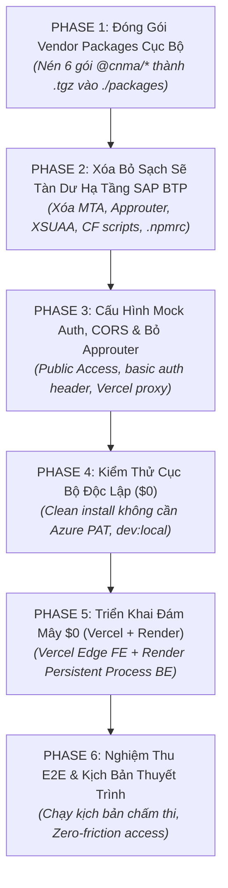
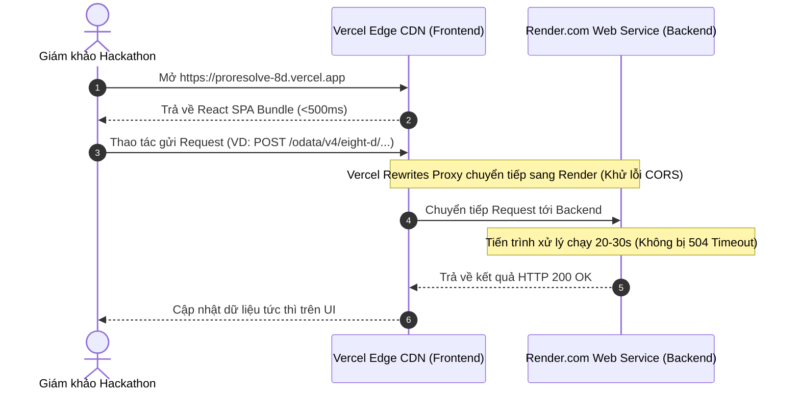

# 🛠️ CẨM NANG CHUYỂN GIAO CÔNG NGHỆ: TÁCH RỜI HẠ TẦNG SAP BTP SANG CLOUD $0 (VERCEL + RENDER)

> **Dự án:** 8D Copilot (CNMA Proresolve)**Mục tiêu:** Loại bỏ **100%** tàn dư hạ tầng SAP BTP (MTA, SAP Approuter, XSUAA, Cloud Foundry scripts, `.npmrc` Azure Artifacts), chuyển đổi cơ chế định danh sang Mock Auth, đóng gói Vendor Packages nội bộ, và thiết lập luồng triển khai Cloud-native hoàn toàn miễn phí ($0) trên **Vercel** và **Render.com**.**Phạm vi phân công:**
>
> * 🟢 **Trong tài liệu này:** Xóa bỏ tàn dư hạ tầng SAP BTP, đóng gói vendor cục bộ (`@cnma/*`), cấu hình Mock Auth & CORS, thay thế SAP Approuter bằng Vercel Edge Rewrites, triển khai Vercel + Render.com, và nghiệm thu E2E.
> * ⚪ **Đã có người phụ trách riêng (Out of scope):** Chuyển giao Cơ sở dữ liệu (SQLite, schema, seed data) và Tích hợp AI Core sang Google Gemini API SDK (`standaloneLlmProvider.ts`).

---

## 📑 MỤC LỤC CHI TIẾT

1. [BẢN ĐỒ DỌN DẸP HẠ TẦNG SAP (PURGE INVENTORY)](#1-bản-đồ-dọn-dẹp-hạ-tầng-sap-purge-inventory)
2. [WORKFLOW CHUYỂN GIAO HẠ TẦNG THEO 5 PHASE END-TO-END](#2-workflow-chuyển-giao-hạ-tầng-theo-5-phase-end-to-end)
   - [PHASE 1: ĐÓNG GÓI VENDOR PACKAGES CỤC BỘ (`@cnma/*`)](#phase-1-đóng-gói-vendor-packages-cục-bộ-cnma)
   - [PHASE 2: PHẪU THUẬT LOẠI BỎ TRIỆT ĐỂ TÀN DƯ HẠ TẦNG SAP BTP](#phase-2-phẫu-thuật-loại-bỏ-triệt-để-tàn-dư-hạ-tầng-sap-btp)
   - [PHASE 3: ĐỊNH DANH MOCK AUTH, ĐIỀU TUYẾN &amp; CORS (BỎ SAP APPROUTER)](#phase-3-định-danh-mock-auth-điều-tuyến--cors-bỏ-sap-approuter)
   - [PHASE 4: KIỂM THỬ XÁC MINH CỤC BỘ ĐỘC LẬP ($0 LOCAL SMOKE TEST)](#phase-4-kiểm-thử-xác-minh-cục-bộ-độc-lập-0-local-smoke-test)
   - [PHASE 5: TRIỂN KHAI ĐÁM MÂY $0 (VERCEL + RENDER CLOUD SETUP)](#phase-5-triển-khai-đám-mây-0-vercel--render-cloud-setup)
   - [PHASE 6: NGHIỆM THU CUỐI CÙNG &amp; KỊCH BẢN BẢO VỆ TRƯỚC GIÁM KHẢO](#phase-6-nghiệm-thu-cuối-cùng--kịch-bản-bảo-vệ-trước-giám-khảo)
3. [CHEATSHEET CÂU LỆNH THỰC THI NHANH](#3-cheatsheet-câu-lệnh-thực-thi-nhanh)

---

## 1. BẢN ĐỒ DỌN DẸP HẠ TẦNG SAP (PURGE INVENTORY)

Dưới đây là danh sách toàn bộ các thành phần hạ tầng SAP BTP và Azure DevOps còn tồn đọng trong repo cần xử lý:

| Thành phần hạ tầng            | Vị trí hiện tại trong Repo                                                                            | Hành động xử lý          | Lý do loại bỏ / Thay thế                                                                |
| :-------------------------------- | :-------------------------------------------------------------------------------------------------------- | :---------------------------- | :------------------------------------------------------------------------------------------ |
| **BTP MTA Descriptor**      | [mta.yaml](file:///d:/GitHub/8D_Hackathon/mta.yaml)`mta_archives/`                                       | **XÓA HOÀN TOÀN**    | Không còn đóng gói Multi-Target Application để deploy lên SAP Cloud Foundry.        |
| **XSUAA Security**          | [xs-security.json](file:///d:/GitHub/8D_Hackathon/xs-security.json)                                        | **XÓA HOÀN TOÀN**    | Bỏ cơ chế bắt buộc login SAP Universal ID / OAuth2 doanh nghiệp.                      |
| **SAP Approuter**           | `app/approuter/`                                                                                        | **XÓA HOÀN TOÀN**    | Thay thế bằng**Vercel Edge Rewrites Proxy** (không cần Node.js container riêng). |
| **BTP Secret / Binding**    | `.cdsrc-private.json`                                                                                   | **XÓA HOÀN TOÀN**    | Chứa thông tin Org, Space, Service Binding của SAP Cloud Foundry nội bộ.               |
| **Azure NPM Registry**      | `.npmrcapp/8D_hackathon_ui/.npmrc`                                                                   | **XÓA HOÀN TOÀN**    | Ngắt kết nối khỏi Azure Artifacts PAT để ai clone repo cũng chạy được.           |
| **Thư viện Auth SAP**     | `@sap/xsenv@sap/xssec`                                                                                  | **GỠ BỎ (UNINSTALL)** | Các gói runtime kiểm tra token JWT của XSUAA trên Cloud Foundry.                       |
| **SAP Maintenance Scripts** | `scripts/check-approuter-route.mjsscripts/check-cf-target.mjs`                                          | **XÓA HOÀN TOÀN**    | Các script tiền kiểm tra route Approuter và target Cloud Foundry trước deploy.        |
| **Cloud Foundry Scripts**   | [package.json](file:///d:/GitHub/8D_Hackathon/package.json) (`cf:*`, `build:mta`, `deploy:cf`, v.v.) | **XÓA KHỎI SCRIPTS**  | Dọn dẹp toàn bộ lệnh CLI`cf login`, `cf deploy`, `cf logs`.                      |

---

## 2. WORKFLOW CHUYỂN GIAO HẠ TẦNG THEO 5 PHASE END-TO-END



---

### PHASE 1: ĐÓNG GÓI VENDOR PACKAGES CỤC BỘ (`@cnma/*`)

> [!IMPORTANT]
> **QUY TẮC BẮT BUỘC:** Phải chạy bước này **TRƯỚC KHI** xóa các tệp `.npmrc`. Nếu xóa `.npmrc` trước, bạn sẽ mất quyền tải các package từ Azure Artifacts feed khi cần cài đặt lại!

Dự án hiện dùng 6 thư viện nội bộ `@cnma/*` trong `node_modules`. Ta sẽ đóng gói chúng thành các file nén `.tgz` lưu tại thư mục `./packages` để dự án tự cấp phát phụ thuộc (Self-contained Vendor).

#### Bước 1.1: Tạo thư mục chứa Vendor Packages

Mở PowerShell tại thư mục gốc dự án:

```powershell
New-Item -ItemType Directory -Force -Path "./packages"
```

#### Bước 1.2: Đóng gói các package `@cnma/*`

Chạy tuần tự các lệnh sau:

```powershell
# 1. Package giao diện React UI
Push-Location "node_modules/@cnma/react-ui"; npm pack --pack-destination ../../../packages; Pop-Location

# 2. Package Core Framework CAP
Push-Location "node_modules/@cnma/cap-core"; npm pack --pack-destination ../../../packages; Pop-Location

# 3. Package Identity & Shadow Users
Push-Location "node_modules/@cnma/cap-identity"; npm pack --pack-destination ../../../packages; Pop-Location

# 4. Package F4 Value Help
Push-Location "node_modules/@cnma/cap-valuehelp"; npm pack --pack-destination ../../../packages; Pop-Location

# 5. Package Workflow State Machine
Push-Location "node_modules/@cnma/cap-workflow"; npm pack --pack-destination ../../../packages; Pop-Location

# 6. Package AI Core Integration (dùng kiểu dữ liệu CanonicalMessage)
Push-Location "node_modules/@cnma/sap-aicore-integrate"; npm pack --pack-destination ../../../packages; Pop-Location
```

Kiểm tra thư mục `packages/`:

```powershell
Get-ChildItem -Path ./packages
```

*(Kết quả phải hiển thị đủ 6 tệp `.tgz` tương ứng).*

---

### PHASE 2: PHẪU THUẬT LOẠI BỎ TRIỆT ĐỂ TÀN DƯ HẠ TẦNG SAP BTP

Sau khi đã lưu giữ an toàn các package vendor ở Phase 1, ta tiến hành dọn sạch toàn bộ các file hạ tầng SAP BTP.

#### Bước 2.1: Xóa các tệp tin MTA, XSUAA & Approuter

Chạy lệnh PowerShell tại thư mục gốc:

```powershell
# Xóa cấu hình triển khai MTA và XSUAA
Remove-Item -Force -ErrorAction SilentlyContinue mta.yaml
Remove-Item -Force -ErrorAction SilentlyContinue xs-security.json
Remove-Item -Force -Recurse -ErrorAction SilentlyContinue mta_archives
Remove-Item -Force -Recurse -ErrorAction SilentlyContinue .cnma_proresolve_mta_build_tmp

# Xóa bỏ hoàn toàn module SAP Approuter
Remove-Item -Force -Recurse -ErrorAction SilentlyContinue app/approuter
```

#### Bước 2.2: Xóa bỏ tệp bí mật kết nối BTP & Azure NPM Registry

```powershell
# Xóa tệp binding kết nối BTP cá nhân
Remove-Item -Force -ErrorAction SilentlyContinue .cdsrc-private.json

# Xóa bỏ triệt để các tệp .npmrc (chứa Azure Personal Access Token)
Remove-Item -Force -ErrorAction SilentlyContinue .npmrc
Remove-Item -Force -ErrorAction SilentlyContinue app/8D_hackathon_ui/.npmrc
Remove-Item -Force -ErrorAction SilentlyContinue gen/srv/.npmrc
```

#### Bước 2.3: Xóa các script kiểm tra Cloud Foundry

```powershell
Remove-Item -Force -ErrorAction SilentlyContinue scripts/check-approuter-route.mjs
Remove-Item -Force -ErrorAction SilentlyContinue scripts/check-cf-target.mjs
```

#### Bước 2.4: Gỡ bỏ thư viện SAP Auth trong [package.json](file:///d:/GitHub/8D_Hackathon/package.json)

Mở [package.json](file:///d:/GitHub/8D_Hackathon/package.json), tìm và **XÓA BỎ** các dòng sau trong mục `"dependencies"`:

```json
    "@sap/xsenv": "^5.4.0",
    "@sap/xssec": "^4.2.8",
```

#### Bước 2.5: Dọn dẹp danh mục `"scripts"` trong [package.json](file:///d:/GitHub/8D_Hackathon/package.json)

Xóa toàn bộ các script Cloud Foundry (`cf:*`, `build:mta`, `build:cf`, `predeploy`, `deploy`). Danh mục script tinh gọn chuẩn như sau:

```json
  "scripts": {
    "start": "cds-serve",
    "dev": "concurrently -k -p \"[{name}]\" -c \"cyan.bold,magenta.bold\" -n \"BE,FE\" \"npm run dev:backend:local\" \"npm run dev:frontend\"",
    "dev:local": "concurrently -k -p \"[{name}]\" -c \"cyan.bold,magenta.bold\" -n \"BE,FE\" \"npm run dev:backend:local\" \"npm run dev:frontend\"",
    "dev:backend:local": "tsx node_modules/@sap/cds-dk/bin/cds-tsx.js watch --profile local --port 4008 --exclude app,dist,gen,mock-data,docs,plans,resources,db.sqlite,db.sqlite-wal,db.sqlite-shm < NUL",
    "dev:frontend": "node scripts/wait-backend.mjs && npm run dev --prefix app/8D_hackathon_ui",
    "clean": "node -e \"['gen','dist','ui_resources','app/ui_resources'].forEach(d=>{try{require('fs').rmSync(d,{recursive:true,force:true})}catch(e){}})\"",
    "build": "npm run bundle:library && cds build --production",
    "test": "jest",
    "typecheck": "tsc --noEmit",
    "lint": "eslint .",
    "export:prompts": "node --import ./node_modules/tsx/dist/loader.mjs scripts/export-step-prompts.mjs",
    "push:prompts": "node scripts/push-step-config.mjs",
    "bundle:library": "node scripts/bundle-library.mjs"
  }
```

---

### PHASE 3: ĐỊNH DANH MOCK AUTH, ĐIỀU TUYẾN & CORS (BỎ SAP APPROUTER)

Để người dùng và Ban Giám khảo truy cập trực tiếp hệ thống mà không cần đăng nhập tài khoản SAP Universal ID, ta chuyển sang chế độ Mocked Auth và thiết lập CORS cho Backend.

#### Bước 3.1: Chuyển đổi dependencies `@cnma/*` sang file tarball cục bộ

Trong [package.json](file:///d:/GitHub/8D_Hackathon/package.json) ở thư mục gốc:

```json
  "dependencies": {
    "@cnma/cap-core": "file:./packages/cnma-cap-core-1.0.0.tgz",
    "@cnma/cap-identity": "file:./packages/cnma-cap-identity-1.0.25.tgz",
    "@cnma/cap-valuehelp": "file:./packages/cnma-cap-valuehelp-2.7.2.tgz",
    "@cnma/cap-workflow": "file:./packages/cnma-cap-workflow-1.7.8.tgz",
    "@cnma/sap-aicore-integrate": "file:./packages/cnma-sap-aicore-integrate-3.0.1.tgz",
    "@sap/cds": "^8.8.0",
    "axios": "^1.18.1",
    "cors": "^2.8.5",
    "dotenv": "^16.4.7",
    "express": "^4.21.2",
    "passport": "^0.7.0"
  }
```

Trong [app/8D_hackathon_ui/package.json](file:///d:/GitHub/8D_Hackathon/app/8D_hackathon_ui/package.json):

```json
  "dependencies": {
    "@cnma/cap-identity": "file:../../packages/cnma-cap-identity-1.0.25.tgz",
    "@cnma/cap-valuehelp": "file:../../packages/cnma-cap-valuehelp-2.7.2.tgz",
    "@cnma/react-ui": "file:../../packages/cnma-react-ui-1.1.4.tgz",
    "@cnma/sap-aicore-integrate": "file:../../packages/cnma-sap-aicore-integrate-3.0.1.tgz",
    ...
  }
```

#### Bước 3.2: Cấu hình Mock Auth trong [package.json](file:///d:/GitHub/8D_Hackathon/package.json)

Thiết lập cơ chế xác thực mặc định là `mocked` cho cả môi trường production (thay thế hoàn toàn `xsuaa`):

```json
  "cds": {
    "requires": {
      "auth": {
        "kind": "mocked",
        "users": {
          "admin": {
            "password": "123",
            "roles": [
              "admin",
              "Admin",
              "authenticated-user"
            ]
          }
        }
      }
    }
  }
```

Cập nhật đồng bộ nội dung tệp [.cdsrc.json](file:///d:/GitHub/8D_Hackathon/.cdsrc.json):

```json
{
  "requires": {
    "auth": {
      "kind": "mocked",
      "users": {
        "admin": {
          "password": "123",
          "roles": ["admin", "Admin", "authenticated-user"]
        }
      }
    }
  }
}
```

#### Bước 3.3: Bật Middleware CORS trong [srv/server.ts](file:///d:/GitHub/8D_Hackathon/srv/server.ts)

Đảm bảo [srv/server.ts](file:///d:/GitHub/8D_Hackathon/srv/server.ts) cho phép Frontend từ domain Vercel gọi API về Backend Render:

```typescript
import cors from 'cors';

cds.on('bootstrap', (app: express.Application) => {
    // Kích hoạt CORS cho phép cross-origin
    app.use(cors({
        origin: (origin, callback) => callback(null, true),
        credentials: true,
        methods: ['GET', 'POST', 'PUT', 'PATCH', 'DELETE', 'OPTIONS'],
        allowedHeaders: ['Content-Type', 'Authorization', 'X-Requested-With']
    }));
    ...
});
```

---

### PHASE 4: KIỂM THỬ XÁC MINH CỤC BỘ ĐỘC LẬP ($0 LOCAL SMOKE TEST)

Kiểm tra để bảo đảm dự án hoàn toàn tách biệt khỏi Azure DevOps Private Registry và chạy tốt trên máy cá nhân.

#### Bước 4.1: Clean Install không cần Azure PAT

Xoá sạch các thư mục `node_modules` cũ và chạy cài đặt lại:

```powershell
# Xóa thư mục node_modules hiện tại
Remove-Item -Force -Recurse -ErrorAction SilentlyContinue node_modules
Remove-Item -Force -Recurse -ErrorAction SilentlyContinue app/8D_hackathon_ui/node_modules

# Cài đặt sạch (quá trình này đọc gói từ thư mục packages/)
npm install
npm install --prefix app/8D_hackathon_ui
```

> [!NOTE]
> Kết quả `npm install` phải hoàn thành 100% mà **không gặp bất kỳ lỗi `401 Unauthorized` hay nhắc nhở đăng nhập Azure nào**.

#### Bước 4.2: Khởi động hệ thống cục bộ

Chạy lệnh khởi động đồng thời cả Backend (:4008) và Frontend (:5544):

```powershell
npm run dev:local
```

#### Bước 4.3: Xác nhận trực quan trên trình duyệt

1. Mở trình duyệt tại địa chỉ: `http://localhost:5544`.
2. Kiểm tra giao diện mở thẳng vào Dashboard chính mà **không có màn hình đăng nhập SAP**.
3. Người dùng trên thanh tiêu đề hiển thị: `admin`.

---

### PHASE 5: TRIỂN KHAI ĐÁM MÂY $0 (VERCEL + RENDER CLOUD SETUP)

#### 5.1. Bẫy Timeout Vercel Serverless & Giải pháp Decoupled Split

> [!CAUTION]
> **CẢNH BÁO KIẾN TRÚC:**
>
> * Gói Vercel Hobby ($0) giới hạn thời gian chạy của Serverless Function tối đa là **10 giây**.
> * Tiến trình phân tích 8 bước (D1–D8) của ứng dụng thường mất **15–30 giây**. Nếu deploy Backend lên Vercel Serverless, lệnh phân tích chắc chắn sẽ bị sập bởi lỗi **HTTP 504 Gateway Timeout**.
>
> 👉 **GIẢI PHÁP TỐI ƯU:**
>
> * **Frontend (React UI):** Deploy lên **Vercel** ($0 Edge CDN, tải tĩnh siêu tốc < 500ms).
> * **Backend (Node.js CAP):** Deploy lên **Render.com** ($0 Free Web Service, chạy dạng persistent process, không bị giới hạn timeout 10 giây).



#### 5.2. Cấu hình Backend trên Render.com

1. Truy cập [dashboard.render.com](https://dashboard.render.com) $\rightarrow$ Đăng nhập bằng GitHub.
2. Chọn **New +** $\rightarrow$ **Web Service** $\rightarrow$ Chọn repo `8D_Hackathon`.
3. Điền các tham số cấu hình:
   * **Name:** `cnma-proresolve-backend`
   * **Region:** `Singapore` (Tối ưu độ trễ thấp nhất cho Việt Nam)
   * **Branch:** `main`
   * **Root Directory:** *(Để trống)*
   * **Runtime:** `Node`
   * **Build Command:**
     ```bash
     npm install && npx cds build --production && node scripts/bundle-library.mjs
     ```
   * **Start Command:**
     ```bash
     node node_modules/@sap/cds/bin/cds.js serve all --profile production --port $PORT
     ```
   * **Plan Type:** `Free` (512 MB RAM, 0.1 CPU)
4. Thiết lập Biến môi trường (Environment Variables):
   * `NODE_ENV`: `production`
   * `CDS_CONFIG`: `{"requires":{"auth":{"kind":"mocked"}}}`
5. Bấm **Deploy Web Service**. Chờ quá trình build hoàn tất và ghi lại URL Backend được cấp (Ví dụ: `https://cnma-proresolve-backend.onrender.com`).

#### 5.3. Cấu hình Reverse Proxy thay thế SAP Approuter ([vercel.json](file:///d:/GitHub/8D_Hackathon/app/8D_hackathon_ui/vercel.json))

Tạo mới tệp [app/8D_hackathon_ui/vercel.json](file:///d:/GitHub/8D_Hackathon/app/8D_hackathon_ui/vercel.json) để Vercel đóng vai trò Reverse Proxy chuyển tiếp cuộc gọi API sang Render (loại bỏ hoàn toàn sự cần thiết của SAP Approuter):

```json
{
  "rewrites": [
    { "source": "/odata/:path*", "destination": "https://cnma-proresolve-backend.onrender.com/odata/:path*" },
    { "source": "/api/cnma/:path*", "destination": "https://cnma-proresolve-backend.onrender.com/api/cnma/:path*" },
    { "source": "/identity/:path*", "destination": "https://cnma-proresolve-backend.onrender.com/identity/:path*" },
    { "source": "/identity-admin/:path*", "destination": "https://cnma-proresolve-backend.onrender.com/identity-admin/:path*" },
    { "source": "/workflow/:path*", "destination": "https://cnma-proresolve-backend.onrender.com/workflow/:path*" },
    { "source": "/workflow-admin/:path*", "destination": "https://cnma-proresolve-backend.onrender.com/workflow-admin/:path*" },
    { "source": "/health", "destination": "https://cnma-proresolve-backend.onrender.com/health" },
    { "source": "/(.*)", "destination": "/index.html" }
  ]
}
```

*(Lưu ý: Thay thế domain `cnma-proresolve-backend.onrender.com` bằng URL thực tế của backend bạn tạo ở Bước 5.2).*

#### 5.4. Triển khai Frontend lên Vercel

1. Đăng nhập [vercel.com](https://vercel.com) bằng tài khoản GitHub.
2. Bấm **Add New...** $\rightarrow$ **Project** $\rightarrow$ Chọn repo `8D_Hackathon`.
3. Cài đặt các tham số:
   * **Root Directory:** `app/8D_hackathon_ui`
   * **Framework Preset:** `Vite`
   * **Build Command:** `npm run build`
   * **Output Directory:** `dist`
   * **Install Command:** `npm install`
4. Bấm **Deploy**. Nhận URL chính thức (Ví dụ: `https://proresolve-8d.vercel.app`) để nộp bài và demo.

---

### PHASE 6: NGHIỆM THU CUỐI CÙNG & KỊCH BẢN BẢO VỆ TRƯỚC GIÁM KHẢO

#### 6.1. Checklist nghiệm thu hạ tầng $0

* [X] **Zero Corporate Dependencies:** Clone repository trên máy tính trắng, chạy `npm install` thành công 100% không hỏi tài khoản Azure/SAP.
* [X] **Zero SAP Residue:** Repo không còn `mta.yaml`, `xs-security.json`, `app/approuter`, hay `.cdsrc-private.json`.
* [X] **Zero Friction Access:** Giám khảo mở link Vercel là vào thẳng ứng dụng, tự động nhận vai trò `admin`.
* [X] **Zero CORS Issues:** Toàn bộ API gọi từ UI qua `/odata/*` được Vercel Rewrites chuyển tiếp êm đẹp sang Render Backend.
* [X] **Zero 504 Timeout:** Lệnh phân tích nặng chạy trọn vẹn trên Render mà không bị ngắt quãng giữa chừng.

#### 6.2. Thông điệp kiến trúc thuyết trình trước Ban Giám khảo

Khi thuyết trình tại Hackathon MLAI 2026, hãy tự tin nêu bật:

1. **Khả năng làm chủ và chuyển đổi kiến trúc (Architectural Agility):** Đã chuyển đổi thành công một giải pháp chuẩn Enterprise PaaS đóng kín sang mô hình Cloud-native linh hoạt, triển khai nhanh và dễ mở rộng.
2. **Tính tiếp cận đại chúng ($0 Barrier to Entry):** Không chỉ phục vụ các doanh nghiệp lớn có SAP, ứng dụng có thể được ứng dụng ngay tại bất kỳ xưởng sản xuất hay nhà máy SME nào tại Việt Nam với chi phí bản quyền bằng **0 ĐỒNG**.

---

## 3. CHEATSHEET CÂU LỆNH THỰC THI NHANH

Tóm tắt toàn bộ thao tác hạ tầng bằng PowerShell từ thư mục gốc dự án:

```powershell
# ==============================================================================
# 1. ĐÓNG GÓI VENDOR PACKAGES LOCAL (BẮT BUỘC CHẠY TRƯỚC)
# ==============================================================================
New-Item -ItemType Directory -Force -Path "./packages"
Push-Location "node_modules/@cnma/react-ui"; npm pack --pack-destination ../../../packages; Pop-Location
Push-Location "node_modules/@cnma/cap-core"; npm pack --pack-destination ../../../packages; Pop-Location
Push-Location "node_modules/@cnma/cap-identity"; npm pack --pack-destination ../../../packages; Pop-Location
Push-Location "node_modules/@cnma/cap-valuehelp"; npm pack --pack-destination ../../../packages; Pop-Location
Push-Location "node_modules/@cnma/cap-workflow"; npm pack --pack-destination ../../../packages; Pop-Location
Push-Location "node_modules/@cnma/sap-aicore-integrate"; npm pack --pack-destination ../../../packages; Pop-Location

# ==============================================================================
# 2. XÓA BỎ SẠCH SẼ TÀN DƯ HẠ TẦNG SAP BTP & AZURE NPMRC
# ==============================================================================
Remove-Item -Force -ErrorAction SilentlyContinue mta.yaml, xs-security.json, .cdsrc-private.json, .npmrc, app/8D_hackathon_ui/.npmrc
Remove-Item -Force -Recurse -ErrorAction SilentlyContinue mta_archives, app/approuter
Remove-Item -Force -ErrorAction SilentlyContinue scripts/check-approuter-route.mjs, scripts/check-cf-target.mjs

# ==============================================================================
# 3. KIỂM THỬ LOCAL SẠCH KHÔNG CẦN AZURE PAT
# ==============================================================================
npm install
npm run dev:local
```
