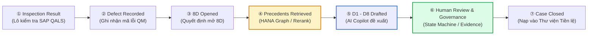
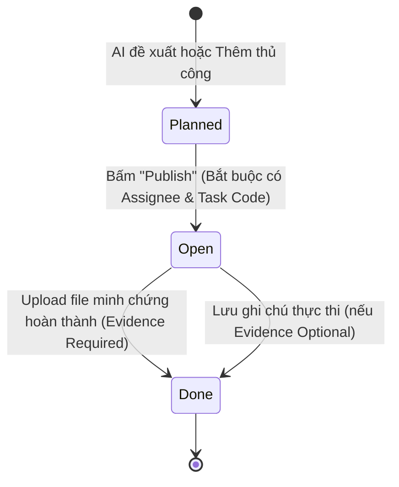
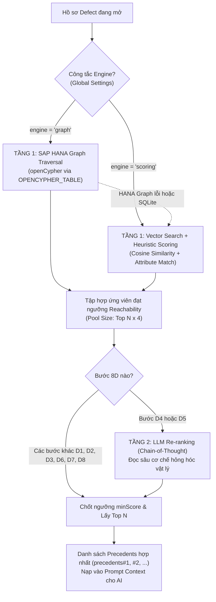

# TÀI LIỆU TOÀN DIỆN VỀ NGHIỆP VỤ 8D VÀ HẠ TẦNG AI

**Dự án:** 8D Copilot (CNMA Proresolve)
**Môi trường:** SAP Business Technology Platform (SAP BTP)
**Đối tượng phục vụ:** Thành viên đội ngũ Hackathon (Software Engineers & Business Analysts)
**Nguyên tắc cốt lõi:** Mã nguồn thực tế là sự thật duy nhất (Code is Ground Truth)

---

## MỤC LỤC

- [TỔNG QUAN HỆ THỐNG VÀ CHUỖI GIÁ TRỊ DOANH NGHIỆP](#tổng-quan-hệ-thống-và-chuỗi-giá-trị-doanh-nghiệp)
- [PHẦN 1: GIÁ TRỊ NGHIỆP VỤ &amp; QUY TRÌNH 8D TỪNG BƯỚC (D1 – D8)](#phần-1-giá-trị-nghiệp-vụ--quy-trình-8d-từng-bước-d1--d8)
  - [D1: Establish the Team (Thành Lập Đội Ngũ)](#d1-establish-the-team-thành-lập-đội-ngũ)
  - [D2: Describe the Problem (Mô Tả Vấn Đề &amp; Ma Trận Is / Is-Not)](#d2-describe-the-problem-mô-tả-vấn-đề--ma-trận-is--is-not)
  - [D3: Interim Containment Actions (Hành Động Chặn Lỗi Tạm Thời)](#d3-interim-containment-actions-hành-động-chặn-lỗi-tạm-thời)
  - [D4: Root Cause Analysis (Phân Tích Nguyên Nhân Gốc Rễ &amp; Thẩm Định Mù)](#d4-root-cause-analysis-phân-tích-nguyên-nhân-gốc-rễ--thẩm-định-mù)
  - [D5: Permanent Corrective Actions (Hành Động Khắc Phục Triệt Để)](#d5-permanent-corrective-actions-hành-động-khắc-phục-triệt-để)
  - [D6: Validate Effectiveness (Xác Minh Hiệu Quả Khắc Phục)](#d6-validate-effectiveness-xác-minh-hiệu-quả-khắc-phục)
  - [D7: Preventive Actions (Hành Động Phòng Ngừa Tái Diễn &amp; Cập Nhật FMEA)](#d7-preventive-actions-hành-động-phòng-ngừa-tái-diễn--cập-nhật-fmea)
  - [D8: Team Recognition &amp; Case Closure (Ghi Nhận Đội Ngũ &amp; Đóng Hồ Sơ 8D)](#d8-team-recognition--case-closure-ghi-nhận-đội-ngũ--đóng-hồ-sơ-8d)
- [PHẦN 2: HẠ TẦNG AI &amp; CÔNG NGHỆ CHUYÊN SÂU (AI &amp; DATA ARCHITECTURE)](#phần-2-hạ-tầng-ai--công-nghệ-chuyên-sâu-ai--data-architecture)
  - [1. Tổng Quan Nền Tảng &amp; Cấu Hình Đa Môi Trường](#1-tổng-quan-nền-tảng--cấu-hình-đa-môi-trường)
  - [2. Chiến Lược Phân Tầng Mô Hình (SAP AI Core Orchestration)](#2-chiến-lược-phân-tầng-mô-hình-sap-ai-core-orchestration)
  - [3. Kiến Trúc Truy Hồi Tiền Lệ 2 Tầng (Precedent Retrieval Architecture)](#3-kiến-trúc-truy-hồi-tiền-lệ-2-tầng-precedent-retrieval-architecture)
  - [4. Bản Đồ Mã Nguồn Hệ Thống (Code Architecture Map)](#4-bản-đồ-mã-nguồn-hệ-thống-code-architecture-map)

---

## TỔNG QUAN HỆ THỐNG VÀ CHUỖI GIÁ TRỊ DOANH NGHIỆP

Trong sản xuất ô tô (VDA 6.3 / IATF 16949) và quản lý chất lượng doanh nghiệp (SAP QM), phương pháp **8D (Eight Disciplines)** là chuẩn mực giải quyết vấn đề có tính kỷ luật cao. Điểm phân biệt cốt lõi giữa hệ thống này với các hệ thống AI thông thường là: **AI không thay thế con người đưa ra quyết định mà đóng vai trò Copilot có căn cứ dữ liệu (Grounded AI)**, tôn trọng tuyệt đối dữ liệu thực tế từ SAP ERP/QM.

Chuỗi giá trị nghiệp vụ được thiết kế nghiêm ngặt:



> [!IMPORTANT]
> **Bước ② (Ghi nhận lỗi) và Bước ③ (Mở 8D) là hai hành động tách biệt hoàn toàn:**
> Phần lớn các lỗi xưởng sản xuất được xử lý tại chỗ mà không cần mở hồ sơ 8D. Chỉ khi một lỗi có tính chất nghiêm trọng, lặp lại hoặc xuất phát từ khiếu nại khách hàng (Customer Complaint), người dùng mới kích hoạt mở hồ sơ 8D từ màn hình Master Data hoặc Defect Record.

---

## PHẦN 1: GIÁ TRỊ NGHIỆP VỤ & QUY TRÌNH 8D TỪNG BƯỚC (D1 – D8)

---

### D1: Establish the Team (Thành Lập Đội Ngũ)

#### 1. Ý nghĩa Nghiệp vụ & Tiêu chuẩn Chất lượng

* Không có một cá nhân nào có thể tự giải quyết vấn đề chất lượng phức tạp. Tiêu chuẩn 8D yêu cầu phải thành lập một **đội ngũ liên chức năng (Cross-Functional Team)** có kiến thức chuyên sâu về sản phẩm, quy trình và hệ thống chất lượng tại trạm xảy ra lỗi.
* **Dữ liệu đầu vào:** Thông tin lỗi hiện tại (Mã lỗi, Trạm làm việc `workCenterId`, Nhóm vật tư `materialFamily`, Sản phẩm `materialId`).

#### 2. Nghiệp vụ trong Hệ thống & Vòng đời Dữ liệu

* Hệ thống phân biệt rạch ròi giữa 2 cấu trúc:
  * `team.roster`: Danh sách đội ngũ do AI đề xuất.
  * `team.assignedRoster`: Danh sách đội ngũ chính thức do kỹ sư/quản lý chất lượng phê duyệt (`Save Team Assignment`).
* Đội ngũ phải có cơ cấu chuẩn SAP QM:
  * **Team Leader (Trưởng nhóm):** Người chịu trách nhiệm điều phối chính.
  * **Champion / Sponsor:** Đại diện quản lý bảo trợ nguồn lực.
  * **Members (Thành viên):** Kỹ sư quy trình, kỹ thuật viên vận hành, đại diện QA/QC.
* Nghiệp vụ kiểm tra tính hợp lệ: Người được chọn phải thuộc danh mục nhân sự đối tác (`ValueHelpService` / Partner Directory) và có chuyên môn phù hợp với trạm làm việc (`WorkCenter`).

#### 3. Cơ chế AI Xử lý & Ràng buộc Dữ liệu

* **Truy hồi tiền lệ (Precedent Retrieval):** Thuật toán Graph trích xuất các hồ sơ lỗi lịch sử có cùng `workCenter` và `materialFamily`.
* **Cơ chế Prompt & Suy luận:**
  * Nếu hồ sơ hiện tại đã có chỉ định nhân sự từ SAP: AI giữ nguyên dữ liệu gốc làm cơ sở thực tế (`x-source: sap_qm`).
  * Nếu hồ sơ chưa có nhân sự: AI quét danh sách đội ngũ từ các case tiền lệ (`precedents#N`), nhận diện các vai trò thực tế (Leader, Member, Specialist) và đề xuất người thật đã từng xử lý thành công lỗi tương tự.
  * **Cấm tuyệt đối (Negative Constraint):** Không được tự bịa ra các chức danh hoặc tên người không có trong cơ sở dữ liệu. Phải trích dẫn nguồn `sources: ["team.leader", "precedents#1.team"]`.
* **Hậu xử lý (`postProcess.ts`):** Rà soát danh sách trích dẫn, gán cờ `dataBacked = false` nếu không tìm thấy dữ liệu đối chiếu trong SAP QM hoặc case tiền lệ.

#### 4. Code Tham Chiếu

* **Prompt & Schema:** [prompts.ts](file:///d:/GitHub/8D_Hackathon/srv/src/domain/eightd/prompts.ts) (Hàm `DEFAULT_DISCIPLINE_GUIDE.D1`), [schemas.ts](file:///d:/GitHub/8D_Hackathon/srv/src/domain/eightd/schemas.ts)
* **Frontend Widget:** [team-roster-widget.tsx](file:///d:/GitHub/8D_Hackathon/app/cnma_proresolve_ui/src/pages/eight-d/team-roster-widget.tsx)
* **Value Help Partner:** [ValueHelpService.cds](file:///d:/GitHub/8D_Hackathon/srv/ValueHelpService.cds)

---

### D2: Describe the Problem (Mô Tả Vấn Đề & Ma Trận Is / Is-Not)

#### 1. Ý nghĩa Nghiệp vụ & Tiêu chuẩn Chất lượng

* Phương pháp Kepner-Tregoe đòi hỏi mô tả vấn đề không chỉ bằng văn bản cảm tính mà bằng sự đối lập: **Cái gì bị lỗi (IS) và Cái gì lẽ ra bị nhưng thực tế KHÔNG BỊ (IS-NOT)**.
* **Dữ liệu đầu vào:** Thông tin lỗi 5W2H (What, When, Where, Who, Why, How, How Many) và tập dữ liệu các lô kiểm tra lịch sử (SAP QM `QALS`/`QAMR`).

#### 2. Nghiệp vụ trong Hệ thống & Vòng đời Dữ liệu

* **Phân tích đối chuẩn Is / Is-Not tất định (Deterministic Matrix):**
  * Hệ thống không giao phó việc lập bảng Is / Is-Not cho LLM tự tưởng tượng. File [isIsNot.ts](file:///d:/GitHub/8D_Hackathon/srv/src/domain/eightd/isIsNot.ts) thực thi thuật toán thống kê từ dữ liệu lô kiểm tra:
  * Gom nhóm các lô kiểm tra theo thiết bị/đồ gá (`equipment`).
  * Tính tỷ lệ không đạt (Non-conforming Rate) của từng nhóm (yêu cầu mỗi nhóm $\ge 2$ lô).
  * So sánh nhóm có tỷ lệ lỗi cao nhất (IS) với nhóm có tỷ lệ lỗi thấp nhất (IS-NOT).
  * Nếu độ tương phản (Contrast) $\ge 25\%$, hệ thống xác nhận đây là bằng chứng kỹ thuật then chốt; nếu không đủ tương phản hoặc thiếu số đo, ghi rõ lý do không áp dụng (`applicable: false`).

#### 3. Cơ chế AI Xử lý & Ràng buộc Dữ liệu

* **Mô tả 5W2H:** AI trích xuất thông số kỹ thuật (giá trị đo `measuredValue`, giới hạn chuẩn `specValue`, đơn vị đo `specUom`) và tình trạng vượt ngưỡng (`outOfSpec`).
* **Tiếp thu dữ liệu Is / Is-Not:** AI nhận kết quả tính toán khách quan từ `isIsNot.ts`, điền vào form mà không được tự ý sửa đổi số liệu đo đạc của nhà máy.
* **Q1 vs Q3 Context:**
  * Khi xuất xứ là khiếu nại khách hàng (`Q1 - Customer Complaint`), AI bổ sung phần `customerSummary` với văn phong lịch sự, không đổ lỗi nội bộ.
  * Khi là lỗi nội bộ (`Q3 - Internal Defect`), `customerSummary` được đặt thành `null`.

#### 4. Code Tham Chiếu

* **Thuật toán Is/Is-Not:** [isIsNot.ts](file:///d:/GitHub/8D_Hackathon/srv/src/domain/eightd/isIsNot.ts)
* **Frontend Display:** [problem-widgets.tsx](file:///d:/GitHub/8D_Hackathon/app/cnma_proresolve_ui/src/pages/eight-d/problem-widgets.tsx)
* **Hậu xử lý:** [postProcess.ts](file:///d:/GitHub/8D_Hackathon/srv/src/domain/eightd/postProcess.ts) (`reconcileD2IsIsNot`)

---

### D3: Interim Containment Actions (Hành Động Chặn Lỗi Tạm Thời)

#### 1. Ý nghĩa Nghiệp vụ & Tiêu chuẩn Chất lượng

* Hành động ngăn chặn tạm thời (ICA) nhằm mục tiêu duy nhất: **Cách ly lập tức sản phẩm lỗi, bảo vệ khách hàng và dây chuyền tiếp theo 100%**, trước khi tìm ra nguyên nhân gốc rễ.
* Ví dụ: Dừng lô hàng, cách ly kho, tăng cường kiểm tra 200%, lắp đồ gá chặn tạm.

#### 2. Nghiệp vụ trong Hệ thống & Vòng đời Dữ liệu (State Machine)

* Hành động được quản lý qua bảng nhiệm vụ thực thi: [action-table.tsx](file:///d:/GitHub/8D_Hackathon/app/cnma_proresolve_ui/src/pages/eight-d/action-table.tsx) tuân thủ mô hình máy trạng thái nghiêm ngặt:



* **Quy tắc chuyển trạng thái bất biến:**
  1. **Planned $\rightarrow$ Open:** Người dùng không thể chọn trực tiếp trạng thái trong dropdown. Task chỉ chuyển sang `Open` khi kỹ sư bấm nút **Publish**. Điều kiện tiên quyết: Task phải có người phụ trách (`assignee`), thời lượng (`durationDays`), và mã nhiệm vụ SAP (`taskCode`).
  2. **Open $\rightarrow$ Done:** Task chỉ chuyển sang `Done` khi:
     * **Trường hợp bắt buộc minh chứng (`evidenceRequired = true`):** Kỹ sư phải upload ít nhất một tài liệu đính kèm (PDF biên bản kiểm tra, ảnh cách ly kho) qua `TaskEvidenceSection`.
     * **Trường hợp không bắt buộc minh chứng (`evidenceRequired = false`):** Kỹ sư nhập và lưu ghi chú hoàn thành (`Execution Notes & Remarks`).

#### 3. Cơ chế AI Xử lý & Ràng buộc Dữ liệu

* AI tra cứu các hành động loại `Containment` trong các case tiền lệ có cùng triệu chứng hoặc mã lỗi tương đương.
* Đề xuất các hành động cụ thể, thời gian ước tính và tự động liên kết với bộ mã danh mục hành động SAP QM (`taskCodeGroup: 'ACT-CONT'`).

#### 4. Code Tham Chiếu

* **Máy trạng thái & Quản trị Task:** [action-table.tsx](file:///d:/GitHub/8D_Hackathon/app/cnma_proresolve_ui/src/pages/eight-d/action-table.tsx), [action-task.ts](file:///d:/GitHub/8D_Hackathon/shared/action-task.ts)
* **Bằng chứng nhiệm vụ:** [task-evidence.tsx](file:///d:/GitHub/8D_Hackathon/app/cnma_proresolve_ui/src/pages/eight-d/task-evidence.tsx)

---

### D4: Root Cause Analysis (Phân Tích Nguyên Nhân Gốc Rễ & Thẩm Định Mù)

#### 1. Ý nghĩa Nghiệp vụ & Tiêu chuẩn Chất lượng

* Tìm ra cơ chế hỏng hóc kỹ thuật thật sự (Technical Root Cause) và lỗ hổng hệ thống quản lý (Management Root Cause) cho phép lỗi xảy ra mà không bị phát hiện.
* **Công cụ cốt lõi:** Biểu đồ xương cá Ishikawa (5M1E: Man, Machine, Material, Method, Measurement, Environment) và chuỗi 5-Why.

#### 2. Nghiệp vụ trong Hệ thống & Cơ Chế Thẩm Định Mù (Blind Diagnosis)

* Để tránh hiện tượng "Confirmation Bias" (kỹ sư kết luận vội vã theo định kiến), hệ thống cài đặt cơ chế **Independent AI Diagnosis (Chẩn đoán độc lập / Thẩm định mù)**:
  * Hệ thống tách riêng toàn bộ dữ liệu suy đoán chủ quan (5-Why ghi sẵn, cờ `is_root_cause`, kết luận FMEA).
  * Chỉ đưa các dữ kiện thô (số đo vượt spec, vật tư, trạm làm việc) cho một mô hình AI độc lập phân tích.
  * Đối chiếu kết luận của AI độc lập với ghi nhận trên hệ thống:
    * Nếu trùng khớp: Đánh dấu **AGREES** $\rightarrow$ Độ tin cậy cao.
    * Nếu sai lệch: Đánh dấu **DISAGREES** $\rightarrow$ Cảnh báo kỹ sư cần kiểm chứng lại hiện trường trước khi phê duyệt.

#### 3. Cơ chế AI Xử lý & Ràng buộc Dữ liệu

* **2-Stage Retrieval & Re-ranking:** D4 là bước duy nhất kích hoạt mô hình Re-ranking bằng LLM (Chain-of-Thought). Mô hình đọc sâu mô tả lỗi và từng case tiền lệ để đánh giá sự trùng khớp về mặt cơ chế vật lý hỏng hóc.
* **Phát sinh biểu đồ xương cá & 5-Why:** AI sinh chuỗi 5 câu hỏi liên hoàn. Câu hỏi cuối cùng phải chỉ thẳng vào nguyên nhân gốc rễ và được đánh dấu `(root cause)`.
* **Cơ chế Backfill bảo toàn:** Nếu model sinh thiếu trường hoặc JSON không chuẩn, hàm `backfillD4FromContext` trong [postProcess.ts](file:///d:/GitHub/8D_Hackathon/srv/src/domain/eightd/postProcess.ts) tự động khôi phục cấu trúc từ dữ kiện SAP ERP.

#### 4. Code Tham Chiếu

* **Chẩn đoán độc lập (Blind Review):** [independentAnalysis.ts](file:///d:/GitHub/8D_Hackathon/srv/src/domain/eightd/independentAnalysis.ts)
* **Giao diện hiển thị Ishikawa & 5-Why:** [cause-widgets.tsx](file:///d:/GitHub/8D_Hackathon/app/cnma_proresolve_ui/src/pages/eight-d/cause-widgets.tsx)
* **Re-ranking Engine:** [reranker.ts](file:///d:/GitHub/8D_Hackathon/srv/src/domain/eightd/precedent/reranker.ts)

---

### D5: Permanent Corrective Actions (Hành Động Khắc Phục Triệt Để)

#### 1. Ý nghĩa Nghiệp vụ & Tiêu chuẩn Chất lượng

* Khác với D3 (chặn lỗi tạm thời), D5 là các hành động **loại bỏ vĩnh viễn nguyên nhân gốc rễ** đã được xác định tại D4.
* Ví dụ: Thay đổi thiết kế đồ gá, hiệu chỉnh chương trình CNC, thay thế nhà cung cấp vật liệu.

#### 2. Nghiệp vụ trong Hệ thống & Vòng đời Dữ liệu

* **Ràng buộc phụ thuộc D4 $\rightarrow$ D5 (Root Cause Alignment):**
  * Mỗi hành động khắc phục tại D5 **bắt buộc phải gắn với một nguyên nhân gốc rễ cụ thể từ D4** (`RootCauseChip`). Không chấp nhận một hành động lơ lửng không rõ khắc phục nguyên nhân nào.
* **Vòng đời trạng thái nhiệm vụ:** Áp dụng máy trạng thái chuẩn tương tự D3: `Planned` $\rightarrow$ `Open` khi Publish $\rightarrow$ `Done` khi có bằng chứng nghiệm thu kỹ thuật hoặc biên bản hoàn thành.

#### 3. Cơ chế AI Xử lý & Ràng buộc Dữ liệu

* AI tra cứu các hành động loại `Corrective` trong cơ sở dữ liệu tiền lệ.
* Gợi ý phân loại mã nhiệm vụ theo chuẩn danh mục hành động sửa đổi (`ACT-CORR`).

#### 4. Code Tham Chiếu

* **Ràng buộc D4-D5 & UI:** [action-table.tsx](file:///d:/GitHub/8D_Hackathon/app/cnma_proresolve_ui/src/pages/eight-d/action-table.tsx) (xem `disciplineCode === 'D5'`), [task-catalogue.ts](file:///d:/GitHub/8D_Hackathon/shared/task-catalogue.ts)

---

### D6: Validate Effectiveness (Xác Minh Hiệu Quả Khắc Phục)

#### 1. Ý nghĩa Nghiệp vụ & Tiêu chuẩn Chất lượng

* Không được phép cho rằng hành động ở D5 đã thực hiện là vấn đề đã xong. D6 bắt buộc phải có **bằng chứng thống kê chứng minh lỗi không còn xuất hiện** sau khi áp dụng giải pháp.
* Tiêu chuẩn: Kiểm tra lại các lô sản xuất kế tiếp (ví dụ: chạy thử 30 ca liên tục không phát sinh phế phẩm, chỉ số Cpk $\ge 1.33$).

#### 2. Nghiệp vụ trong Hệ thống & Cổng Phê Duyệt (Approval Gate)

* D6 thiết lập các chỉ số định lượng: Giá trị đo lường trước can thiệp (Baseline) vs. sau can thiệp (Verified Metric).
* **Cổng phê duyệt đóng bước (Gate Check):** Hồ sơ 8D không thể chuyển sang bước tiếp theo nếu D6 chưa được xác nhận hiệu quả bằng số liệu đo kiểm thực tế.

#### 3. Cơ chế AI Xử lý & Ràng buộc Dữ liệu

* AI tổng hợp kế hoạch thẩm tra: phương pháp đo lường, cỡ mẫu kiểm tra (`sampleSize`), thời gian theo dõi, và tiêu chí nghiệm thu (Acceptance Criteria).
* Xác thực tính nhất quán giữa thông số đo được kiểm tra với đặc tính kỹ thuật (`InspectionRow.characteristic`) ban đầu ở D2.

#### 4. Code Tham Chiếu

* **Prompt Hướng Dẫn:** [prompts.ts](file:///d:/GitHub/8D_Hackathon/srv/src/domain/eightd/prompts.ts) (`DEFAULT_DISCIPLINE_GUIDE.D6`)
* **Logic Kiểm Tra:** [stepGraph.ts](file:///d:/GitHub/8D_Hackathon/srv/src/domain/eightd/stepGraph.ts)

---

### D7: Preventive Actions (Hành Động Phòng Ngừa Tái Diễn & Cập Nhật FMEA)

#### 1. Ý nghĩa Nghiệp vụ & Tiêu chuẩn Chất lượng

* Phòng ngừa tái diễn đòi hỏi sửa đổi **tận gốc hệ thống tài liệu và quy trình quản trị**: Cập nhật hồ sơ phân tích rủi ro FMEA, Kế hoạch kiểm soát (Control Plan), và Hướng dẫn công việc (Standard Operating Procedures - SOP).
* **Tư duy phòng ngừa mở rộng (Horizontal Deployment):** Áp dụng bài học kinh nghiệm này cho tất cả các dây chuyền hoặc linh kiện có cùng cấu trúc (`MaterialFamily`), chứ không chỉ gói gọn tại trạm phát sinh lỗi.

#### 2. Nghiệp vụ trong Hệ thống & Vòng đời Dữ liệu

* **Liên kết trực tiếp SAP FMEA (`cnma.proresolve.FmeaRegister`):**
  * Hệ thống yêu cầu liên kết hồ sơ 8D với mã FMEA tương ứng.
  * Tái đánh giá chỉ số rủi ro RPN (Risk Priority Number) hoặc Action Priority (AP) sau khi có giải pháp phòng ngừa.
* **Máy trạng thái nhiệm vụ phòng ngừa:** Tuân thủ chu trình `Planned` $\rightarrow$ `Open` $\rightarrow$ `Done` có kiểm soát bằng chứng cập nhật tài liệu ISO/IATF.

#### 3. Cơ chế AI Xử lý & Ràng buộc Dữ liệu

* **Tìm kiếm tiền lệ theo họ sản phẩm (Material Family):**
  * Trong thuật toán Graph của D7, trọng số của `workCenter` bị cố tình loại bỏ (xem `stepProfiles.ts`), trong khi trọng số của `materialFamily` được tăng lên 4. Lý do: Phòng ngừa phải vươn ra ngoài trạm lỗi hiện tại đến toàn bộ các trạm và dòng sản phẩm tương đồng.
* AI tự động trích xuất các bài học kinh nghiệm (Lessons Learned: What worked, what didn't) để ghi vào hồ sơ tri thức chung.

#### 4. Code Tham Chiếu

* **Cấu hình Graph D7:** [stepProfiles.ts](file:///d:/GitHub/8D_Hackathon/srv/src/domain/eightd/graph/stepProfiles.ts)
* **Thực thể FMEA:** [schema.cds](file:///d:/GitHub/8D_Hackathon/db/schema/schema.cds) (`entity FmeaRegister`)

---

### D8: Team Recognition & Case Closure (Ghi Nhận Đội Ngũ & Đóng Hồ Sơ 8D)

#### 1. Ý nghĩa Nghiệp vụ & Tiêu chuẩn Chất lượng

* Đóng hồ sơ chính thức, tổng kết chi phí tổn thất chất lượng kém (Cost of Poor Quality - COPQ), ghi nhận đóng góp của các thành viên trong đội ngũ D1.
* Chuyển toàn bộ hồ sơ từ trạng thái giải quyết sang **Thư viện tiền lệ lịch sử (Closed Case Library)** để làm giàu tri thức phục vụ các vụ việc trong tương lai.

#### 2. Nghiệp vụ trong Hệ thống & Ghi Lại Lịch Sử (Closed Case Write-Back)

* **Quy trình Đóng Hồ Sơ:**
  * Bắt buộc hoàn thành và xác thực toàn bộ các bước từ D1 đến D7.
  * Kỹ sư trưởng phê duyệt báo cáo tổng kết.
* **Cơ chế nạp tự động vào Thư viện Tiền lệ (`closedCaseWriteBack.ts`):**
  * Khi case đóng, hệ thống tự động trích xuất toàn bộ dữ kiện thực tế: Mã lỗi, trạm làm việc, vật tư, các giải pháp thành công, tên thành viên đội ngũ.
  * Tự động vector hóa và tạo token từ khóa (`searchKeywords`) nạp vào bảng `HistoricalCases`.
  * Đồ thị SAP HANA Graph Workspace tự động kết nạp các node và cạnh mới qua các SQL View phản chiếu mà không cần migrate hay đồng bộ thủ công.

#### 3. Cơ chế AI Xử lý

* AI soạn thảo thông điệp ghi nhận (Recognition Message) tóm lược những nỗ lực nổi bật của đội ngũ, nhấn mạnh hiệu quả bảo vệ khách hàng và chi phí COPQ tiết kiệm được.

#### 4. Code Tham Chiếu

* **Đóng hồ sơ & Ghi lại tiền lệ:** [closedCaseWriteBack.ts](file:///d:/GitHub/8D_Hackathon/srv/src/domain/eightd/precedent/closedCaseWriteBack.ts)
* **Frontend Closure Gate:** [detail.tsx](file:///d:/GitHub/8D_Hackathon/app/cnma_proresolve_ui/src/pages/eight-d/detail.tsx)

---

## PHẦN 2: HẠ TẦNG AI & CÔNG NGHỆ CHUYÊN SÂU (AI & DATA ARCHITECTURE)

---

### 1. Tổng Quan Nền Tảng & Cấu Hình Đa Môi Trường

Hệ thống được phát triển trên kiến trúc **SAP Cloud Application Programming Model (CAP)**, được thiết kế để chạy linh hoạt trên cả đám mây doanh nghiệp lẫn môi trường máy phát triển cục bộ:

```
┌────────────────────────────────────────────────────────────────────────┐
│                        SAP BTP Cloud Foundry                           │
│                                                                        │
│  ┌────────────────────┐   ┌────────────────────┐   ┌────────────────┐  │
│  │   React Frontend   │──▶│  CAP Node.js srv   │──▶│  SAP AI Core  │  │
│  │ (Tailwind + Lucide)│   │   (TypeScript)     │   │ Orchestration  │  │
│  └────────────────────┘   └─────────┬──────────┘   └────────────────┘  │
│                                     │                                  │
│                                     ▼                                  │
│                    ┌─────────────────────────────────┐                 │
│                    │         SAP HANA Cloud          │                 │
│                    │  - Relational Schema (HDI)      │                 │
│                    │  - Vector Engine (cds.Vector)   │                 │
│                    │  - Graph Engine (GW_8D)         │                 │
│                    └─────────────────────────────────┘                 │
└────────────────────────────────────────────────────────────────────────┘
```

* **Môi trường Production / Cloud Foundry (và Hybrid Mode):**
  * **Hệ quản trị cơ sở dữ liệu:** **SAP HANA Cloud** (sử dụng container HDI `cnma_proresolve_db` khai báo qua [mta.yaml](file:///d:/GitHub/8D_Hackathon/mta.yaml) với service plan `hdi-shared`).
  * **Bảo mật & Ủy quyền:** SAP XSUAA (`@sap/xssec` v4.2.8) tích hợp phân quyền vai trò người dùng doanh nghiệp.
  * **Hạ tầng AI:** Kết nối tới **SAP AI Core** thông qua BTP Destination `AICORE`.
* **Môi trường Cục bộ (Local Development):**
  * Chạy trên **SQLite** (`db.sqlite` thông qua package `sqlite3`), cho phép lập trình viên phát triển và kiểm thử giao diện mà không phụ thuộc hạ tầng đám mây.
  * **Cơ chế Fallback thông minh:** Khi phát hiện database là SQLite (không có engine Graph của HANA), hệ thống tự động kích hoạt chế độ Fallback sang engine tính điểm truyền thống mà không phát sinh lỗi crash.

---

### 2. Chiến Lược Phân Tầng Mô Hình (SAP AI Core Orchestration)

Toàn bộ các tác vụ gọi AI được điều phối qua cổng kết nối tập trung `@cnma/sap-aicore-integrate` và bộ SDK chính thức `@sap-ai-sdk/orchestration`. Để tối ưu hóa triệt để giữa **chi phí token, tốc độ phản hồi** và **độ tin cậy của suy luận**, hệ thống triển khai chiến lược phân tầng mô hình rõ ràng tại [srv/src/config/ai.ts](file:///d:/GitHub/8D_Hackathon/srv/src/config/ai.ts):

| Tầng Mô Hình                      | Model Áp Dụng                            | Hoạt Động / Nhiệm Vụ Được Giao                                                                                                                    | Lý Do Thiết Kế Nghiệp Vụ                                                                                                                                                                                                                                          |
| :----------------------------------- | :----------------------------------------- | :-------------------------------------------------------------------------------------------------------------------------------------------------------- | :--------------------------------------------------------------------------------------------------------------------------------------------------------------------------------------------------------------------------------------------------------------------- |
| **Fast Execution Tier**        | `anthropic--claude-4.5-haiku`            | • Trích xuất dữ liệu (`parseData`)• Điền form cấu trúc (`analyzeDefectStructuredFields`)• Soạn thảo sơ bộ 8 bước (`analyzeDefect`) | Tiết kiệm chi phí và tăng tốc độ. Một lượt sinh báo cáo 8D với 8 bước hoàn tất trong**10–20 giây** thay vì 5–6 phút. Tính đúng đắn được giữ bằng Schema JSON chặt chẽ và hàm hậu xử lý tất định (`postProcess.ts`). |
| **Escalation / Fallback Tier** | `anthropic--claude-4.5-sonnet`           | • Cứu hộ bước sinh báo cáo khi Haiku vi phạm schema sau các lượt retry có chỉ dẫn                                                           | Chỉ kích hoạt khi đường đi nhanh thất bại. Đảm bảo quy trình không bao giờ bị đứt gãy giữa chừng.                                                                                                                                                 |
| **Reasoning Tier**             | `gemini-2.5-pro`                         | • Model chat và suy luận tổng quát mặc định của hệ thống                                                                                       | Khả năng lập luận logic và xử lý ngữ cảnh sâu sắc cho các phân tích mở.                                                                                                                                                                                 |
| **Quality Judge Tier**         | Admin chỉ định (Claude Sonnet / GPT-4o) | • Thẩm định chất lượng chẩn đoán mù (`reviewQuality`)• LLM-as-a-Judge đánh giá toàn bộ báo cáo                                       | Cần mô hình mạnh nhất để chấm điểm độc lập, không bị ảnh hưởng bởi mô hình đã sinh ra văn bản.                                                                                                                                                |
| **Embedding Tier**             | `text-embedding-3-small`                 | • Nhúng vector tìm kiếm ngữ nghĩa (1536 chiều)                                                                                                     | Khớp chính xác với kiểu cột`cds.Vector(1536)` trong SAP HANA Cloud.                                                                                                                                                                                            |

---

### 3. Kiến Trúc Truy Hồi Tiền Lệ 2 Tầng (Precedent Retrieval Architecture)

Khác với các ứng dụng RAG thông thường chỉ so sánh văn bản đơn giản, hệ thống giải quyết vấn đề bằng **Kiến trúc truy hồi hỗn hợp 2 tầng (Two-Stage Hybrid Retrieval Pipeline)** được điều phối tại [srv/src/domain/eightd/graph/engine.ts](file:///d:/GitHub/8D_Hackathon/srv/src/domain/eightd/graph/engine.ts):



#### A. Tầng 1: Đồ Thị Tri Thức SAP HANA Graph Engine (Native Graph Workspace)

* **Không cần cài đặt DB đồ thị ngoài:** Tận dụng trực tiếp khả năng xử lý đồ thị trong nhân của **SAP HANA Cloud**.
* **Định nghĩa Workspace:** Khai báo qua file [GW_8D.hdbgraphworkspace](file:///d:/GitHub/8D_Hackathon/db/src/GW_8D.hdbgraphworkspace) gồm **14 loại đỉnh (Vertices)** và **18 loại cạnh (Edges)**.
* **Không nhân bản dữ liệu (Zero Data Duplication):** Tất cả các đỉnh và cạnh đều là **SQL View** được chiếu trực tiếp từ các bảng nghiệp vụ SAP QM (`HistoricalCases`, `OpenDefect`, `WorkCenter`, `Material`, `MaterialFamily`, `Keyword`, `Person`, `Action`, `RootCause`, `Fmea`, `InspectionLot`). Dữ liệu nghiệp vụ cập nhật thì đồ thị tự động cập nhật ngay lập tức.
* **Thực thi openCypher an toàn:** Thông qua hàm `OPENCYPHER_TABLE` trong SQL của HANA ([graphClient.ts](file:///d:/GitHub/8D_Hackathon/srv/src/domain/eightd/graph/graphClient.ts)):
  * **Cypher khớp mẫu (Pattern Matching):** Tìm kiếm các đường liên kết phức tạp đa chặng.
  * **SQL tổng hợp và gom nhóm:** Tính toán trọng số và lọc kết quả.
  * **Bảo mật tuyệt đối:** Giá trị của người dùng không bao giờ nối chuỗi trực tiếp mà truyền qua bind parameter `PARAMETERS ('x' = ?)`.

#### B. Trọng Số Đồ Thị Riêng Biệt Cho Từng Bước D (Step-Specific Graph Weights)

Mỗi bước D đặt một câu hỏi đồ thị khác nhau, do đó trọng số bằng chứng được thiết kế độc lập tại [stepProfiles.ts](file:///d:/GitHub/8D_Hackathon/srv/src/domain/eightd/graph/stepProfiles.ts):

* **D1 (Team):** Ưu tiên trạm làm việc (`workCenter`: 4) và dòng linh kiện (`materialFamily`: 3) để tìm người có kinh nghiệm thực địa.
* **D4 (Root Cause):** Ưu tiên số lượng từ khóa triệu chứng trùng lặp (`keywords`: 3) để tìm đúng cơ chế hỏng hóc vật lý.
* **D7 (Prevention):** Đặt trọng số cao nhất cho dòng linh kiện (`materialFamily`: 4), **cố tình bỏ qua** trạm làm việc (`workCenter`) vì biện pháp phòng ngừa phải mở rộng ra ngoài phạm vi trạm xảy ra lỗi.

#### C. Tầng 2: Tái Xếp Hạng Bằng LLM Kèm Chuỗi Suy Luận (Shared LLM Re-ranking with CoT)

* **Phạm vi áp dụng:** Dành riêng cho **D4 (Root Cause)** và **D5 (Corrective Actions)**.
* **Cơ chế hoạt động ([reranker.ts](file:///d:/GitHub/8D_Hackathon/srv/src/domain/eightd/precedent/reranker.ts)):**
  * Mô hình LLM đọc đồng thời toàn văn mô tả sự cố hiện tại và văn bản của các case ứng viên lọt vào vòng 2.
  * **Chain-of-Thought (CoT):** Mô hình buộc phải giải trình phân tích cơ chế hỏng hóc (Failure Mechanism) trước khi cho điểm số từ 0 đến 100.
  * Điểm re-rank được cộng gộp vào điểm vòng 1 theo công thức: $\text{Điểm Cuối} = \text{Điểm Tầng 1} + \text{Trọng Số} \times \frac{\text{Điểm Re-rank}}{100}$.

---

### 4. Bản Đồ Mã Nguồn Hệ Thống (Code Architecture Map)

| Hạng Mục Kiến Trúc              | Đường Dẫn File Mã Nguồn                                                                                                                        | Chức Năng & Trách Nhiệm Kỹ Thuật                                                                          |
| :---------------------------------- | :--------------------------------------------------------------------------------------------------------------------------------------------------- | :-------------------------------------------------------------------------------------------------------------- |
| **Graph Workspace**           | [db/src/GW_8D.hdbgraphworkspace](file:///d:/GitHub/8D_Hackathon/db/src/GW_8D.hdbgraphworkspace)                                                       | Định nghĩa cấu trúc đồ thị 14 đỉnh, 18 cạnh trên SAP HANA Cloud.                                    |
| **Graph Client**              | [srv/src/domain/eightd/graph/graphClient.ts](file:///d:/GitHub/8D_Hackathon/srv/src/domain/eightd/graph/graphClient.ts)                               | Thực thi câu lệnh openCypher qua`OPENCYPHER_TABLE` với bind params.                                       |
| **Graph Engine Core**         | [srv/src/domain/eightd/graph/engine.ts](file:///d:/GitHub/8D_Hackathon/srv/src/domain/eightd/graph/engine.ts)                                         | Điều phối toàn cục 2 engine, thu thập bằng chứng, quản lý fallback.                                   |
| **Step Weights & Profiles**   | [srv/src/domain/eightd/graph/stepProfiles.ts](file:///d:/GitHub/8D_Hackathon/srv/src/domain/eightd/graph/stepProfiles.ts)                             | Cấu hình trọng số cạnh đồ thị D1–D8 và khung re-ranking cho D4, D5.                                   |
| **LLM Re-ranking**            | [srv/src/domain/eightd/precedent/reranker.ts](file:///d:/GitHub/8D_Hackathon/srv/src/domain/eightd/precedent/reranker.ts)                             | Tái chấm điểm chuyên sâu bằng LLM với suy luận chuỗi (Chain-of-Thought).                              |
| **Is / Is-Not Matrix**        | [srv/src/domain/eightd/isIsNot.ts](file:///d:/GitHub/8D_Hackathon/srv/src/domain/eightd/isIsNot.ts)                                                   | Thuật toán phân tích thống kê đối chuẩn từ dữ liệu lô kiểm tra SAP QM.                            |
| **8D Analyzer Pipeline**      | [srv/src/domain/eightd/eightDAnalyzer.ts](file:///d:/GitHub/8D_Hackathon/srv/src/domain/eightd/eightDAnalyzer.ts)                                     | Pipeline chính điều phối toàn bộ lượt phân tích và sinh báo cáo 8D.                                |
| **Prompt Engineering**        | [srv/src/domain/eightd/prompts.ts](file:///d:/GitHub/8D_Hackathon/srv/src/domain/eightd/prompts.ts)                                                   | Hệ thống System Prompt, luật sinh báo cáo và hướng dẫn từng bước D.                                 |
| **Safety Net & Post-Process** | [srv/src/domain/eightd/postProcess.ts](file:///d:/GitHub/8D_Hackathon/srv/src/domain/eightd/postProcess.ts)                                           | Lưới an toàn hậu xử lý, kiểm soát trích dẫn, backfill dữ liệu tất định.                          |
| **AI Core Client**            | [srv/src/core/ai/llmClient.ts](file:///d:/GitHub/8D_Hackathon/srv/src/core/ai/llmClient.ts)                                                           | Cổng gọi mô hình qua SAP AI Core Orchestration, quản lý timeout, retry.                                   |
| **AI Configuration**          | [srv/src/config/ai.ts](file:///d:/GitHub/8D_Hackathon/srv/src/config/ai.ts)                                                                           | Phân bổ model theo hoạt động (Haiku, Sonnet, Gemini Pro, Embeddings).                                      |
| **Task State Machine (UI)**   | [app/cnma_proresolve_ui/src/pages/eight-d/action-table.tsx](file:///d:/GitHub/8D_Hackathon/app/cnma_proresolve_ui/src/pages/eight-d/action-table.tsx) | Quản trị vòng đời nhiệm vụ`Planned` $\rightarrow$ `Open` $\rightarrow$ `Done` tại D3, D5, D7. |
| **AI Settings Workbench**     | [app/cnma_proresolve_ui/src/pages/workflow/](file:///d:/GitHub/8D_Hackathon/app/cnma_proresolve_ui/src/pages/workflow/)                               | Giao diện quản trị cấu hình AI, chỉnh sửa Prompt, Schema và Graph Weights.                              |
