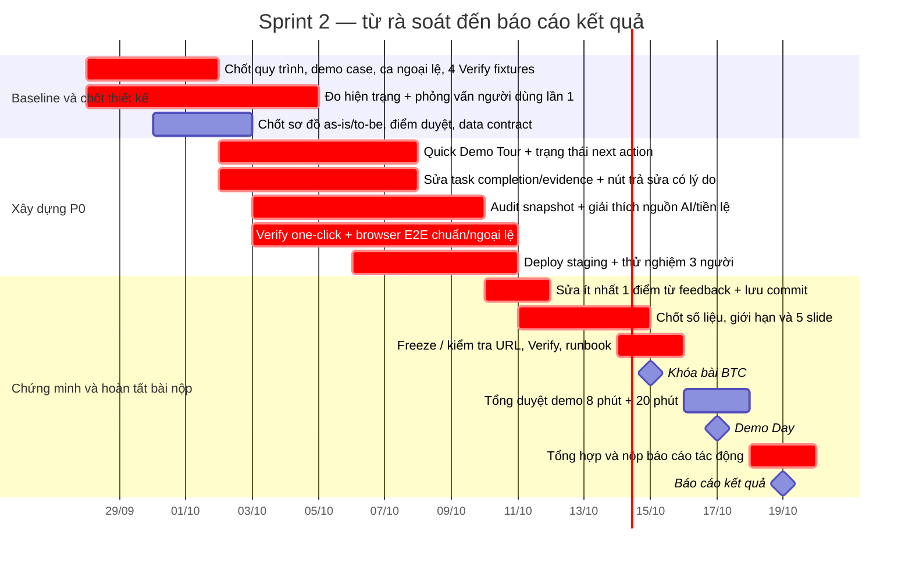
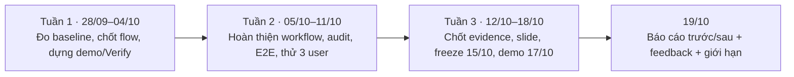
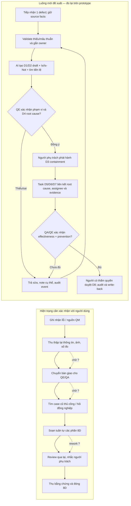

# Kế hoạch Sprint 2 — UIT_4Lovpe / 8D Incident Referee

**Thời gian:** 28/09/2026–18/10/2026 (3 tuần làm việc và tổng duyệt); khóa bài BTC 15/10; Demo Day 17/10; báo cáo kết quả nội bộ 19/10.  
**Quy mô:** 4 thành viên.  
**Đề bài đã chọn:** B — Tái cấu trúc toàn bộ quy trình (*The Whole Workflow*), theo [kế hoạch hackathon hiện có](docs/HACKATHON-ACTION-PLAN.md).  
**Mục tiêu Sprint 2:** biến sản phẩm 8D nhiều chức năng thành một quy trình xử lý sự cố chất lượng dễ trải nghiệm, chạy trọn vẹn, có ranh giới quyết định của con người rõ ràng và có số liệu thực tế chứng minh tác động.

## Baseline tổng quan 3 tuần

Sơ đồ này là baseline kế hoạch (công việc và mốc bàn giao), không phải số liệu hiệu quả sản phẩm. Kết quả đo được sẽ điền vào báo cáo ngày 19/10.

**Định nghĩa “baseline” đo tác động:** trước khi bật workflow mới, ghi thời gian và thao tác người dùng trên một ca hiện trạng; sau khi deploy, chạy ca tương đương với cùng người dùng và cùng điểm bắt đầu/kết thúc. Tách `thời gian thao tác`, `thời gian chờ`, `số lần bàn giao/nhắc`, `số lần sửa`, `quyết định con người`. Nếu hiện trạng không có log timestamp thì ghi “walk-through bấm giờ” cùng ngày, không điền số ước tính vào chỗ dữ liệu thực.

> **Nguyên tắc về số liệu:** Kế hoạch nội bộ hiện có nêu thời gian “48–72 giờ xuống 30–45 phút”. Chỉ dùng đây như giả thuyết cho đến khi có dữ liệu và phương pháp đo kiểm chứng. Không đưa con số này lên slide như kết quả thực tế nếu chưa đo được.

## 1. Tóm tắt sản phẩm và những gì cần ưu tiên

### Sản phẩm hiện có

- Frontend React/Vite ở `app/8D_hackathon_ui`; backend TypeScript/CAP ở `srv/`; dữ liệu mẫu và các bộ clean/dirty ở `mock-data/`.
- Quy trình nghiệp vụ D1–D8, tạo hồ sơ từ defect, phân tích 5W2H và Is/Is-Not, chẩn đoán D4, tìm tiền lệ, nhiệm vụ/bằng chứng, review/approval và đóng hồ sơ.
- Điểm quyết định của người dùng đã hiện diện trong trạng thái phê duyệt; audit trail có panel `AuditTrailPanel`; luồng duyệt và ràng buộc bước nằm trong `eightDRepository.ts`, `stepGraph.ts` và service.
- Có bộ test domain lớn, tài liệu test và dữ liệu mẫu. Đây là nền tảng tốt để làm Verify/E2E mà không phải dựng sản phẩm mới.

### Đánh giá Sprint 1 của BGK

| Nhận xét | Ý nghĩa cho Sprint 2 | Ưu tiên |
|---|---|---:|
| Điểm mạnh: mô hình 8D có chiều sâu, retrieval/reranker bài bản, test domain nhiều, có Docker và hướng dẫn chạy | Giữ nguyên các năng lực này; tập trung đưa chúng thành trải nghiệm có thể hiểu và kiểm chứng nhanh | Duy trì |
| Điểm yếu lớn: thuật ngữ và khối lượng dữ liệu gây quá tải cho BGK/người mới | Làm đường dẫn trải nghiệm một ca xuyên suốt D1–D8, giải thích vì sao AI đề xuất và chỗ nào cần người quyết định | P1 |
| Đề xuất P1: Quick Demo Tour/1-click walkthrough trong khoảng 2 phút | Làm nút bắt đầu từ trang chính, nạp ca mẫu có dữ liệu đã chuẩn bị, dẫn người xem qua luồng và các quyết định then chốt | P1 |
| Rủi ro: thời gian build/khởi động; truy hồi có thể chậm hoặc lỗi khi graph/vector không sẵn sàng | Đo thời gian trên máy triển khai; xác nhận fallback đang hoạt động và báo rõ chế độ fallback; tối ưu điểm nghẽn có số liệu | P2 |
| Khoảng trống được nêu: thiếu kiểm thử trình duyệt đầu-cuối | Thêm một luồng trình duyệt đại diện cho kịch bản demo và trường hợp ngoại lệ | P1 |

### Trọng tâm theo đề bài và rubric BTC

BGK Sprint 1 nhận xét sản phẩm; rubric B và Sprint 2 yêu cầu chứng minh tác động. Ba việc phải song hành:

1. **Tái cấu trúc quy trình được nhìn thấy:** so sánh hiện trạng và luồng mới; thể hiện đổi trình tự, bỏ bàn giao/chờ không cần thiết hoặc tạo điểm điều phối mới, không chỉ “AI điền form nhanh hơn”.
2. **Quy trình mới chạy được đầu-cuối:** một ca bình thường và một ca ngoại lệ; con người có quyền duyệt, trả sửa, dừng/ghi đè; hành động có thể giải thích và tra cứu.
3. **Bằng chứng thực tế:** thử với ít nhất 3 nhân sự trực tiếp làm công việc; lưu phản hồi nguyên văn do chính họ xác nhận; đo trước/sau và công bố cả lợi ích lẫn gánh nặng phát sinh.

Các mục này bám [Challenge Brief](docs/Challenge_Brief_OrganizationAI_VN.docx.md): mục 2.B, mục 3–4 và lịch Sprint 2. Đề bài chấm cao quy trình vận hành, Verify, đầu vào mới, người dùng thật và human-in-the-loop; phần slide 3 và 5 bắt buộc có phương pháp đo và giới hạn cụ thể.

## 2. Đích sản phẩm đến ngày khóa bài

### Kịch bản demo duy nhất: từ lỗi mới đến hồ sơ 8D được duyệt

Giữ phạm vi quy trình: **kỹ sư chất lượng tiếp nhận một lỗi sản xuất, phân loại và khoanh vùng rủi ro, lập nhóm, phân tích nguyên nhân, đề xuất và xác minh hành động, phòng ngừa tái diễn, đóng hồ sơ 8D**.

Màn hình vào có hai lựa chọn nổi bật:

- **“Thử demo 2 phút”** — tạo/mở ca mẫu đã được chọn, dẫn người dùng qua trạng thái và dữ liệu quan trọng. Không tự duyệt hoặc tự đóng hồ sơ thay người dùng.
- **“Thử ca mới”** — cho phép nhập hoặc chọn defect khác để chứng minh hệ thống không chỉ chạy trên một case hard-coded.

Tour nên tối đa 5 điểm dừng: (1) sự cố và dữ liệu gốc, (2) Is/Is-Not và bằng chứng, (3) đề xuất D4 cùng tiền lệ/trích dẫn, (4) hành động cần kỹ sư/QA duyệt, (5) audit trail và trạng thái hoàn tất. Mỗi điểm dừng dùng ngôn ngữ phổ thông: “dữ kiện nào”, “AI suy ra gì”, “độ chắc chắn/thiếu bằng chứng ở đâu”, “ai cần quyết định”. Cho phép đóng tour và tiếp tục thao tác bình thường.

### Ranh giới người và AI cần giữ nhất quán từ UI đến slide 2

- AI **tóm tắt, đối chiếu, gợi ý và soạn nháp**; không xác nhận dữ kiện thiếu, không tự đánh dấu hành động đã hoàn tất, không tự ký duyệt nguyên nhân hoặc đóng case.
- Con người xác nhận dữ liệu/scope ở đầu vào; QE xem xét và duyệt nguyên nhân gốc D4; người phụ trách/QA duyệt và ghi bằng chứng hành động D3/D5/D6/D7; người có thẩm quyền duyệt đóng D8.
- Bất cứ lúc nào, người dùng có thể trả bước về sửa hoặc dừng phân tích/duyệt. UI phải nói rõ bước đang chờ ai và hậu quả khi duyệt.
- Giải thích quyết định bằng nguồn và quy tắc có ý nghĩa nghiệp vụ: “Giá trị 0,32 mm vượt giới hạn 0,10 mm trong lô X; vì vậy đề xuất khoanh vùng lô và cần QE xác nhận”, không chỉ hiện điểm tương đồng.

## 3. Backlog đề xuất — làm gì, ở đâu, hoàn thành khi nào

| ID / ưu tiên | Hạng mục và sửa cụ thể | Khu vực source gợi ý | Tiêu chí nghiệm thu |
|---|---|---|---|
| P0 | **Đường đi demo và onboarding.** Thêm banner/CTA trên trang danh sách 8D, tour 5 điểm dừng, liên kết mỗi điểm tới đúng discipline; dữ liệu demo có nút reset/mở lại để không phụ thuộc trạng thái người trước. | `app/8D_hackathon_ui/src/pages/eight-d/index.tsx`, `detail.tsx`, `App.tsx`; thêm module tour trong `pages/eight-d/` | Người mới bắt đầu từ trang đầu, không cần giải thích trực tiếp; hoàn tất luồng demo dưới 2 phút; vẫn có thể thoát và dùng app; demo không tự ký duyệt thay người. |
| P0 | **Tái cấu trúc và hiển thị quy trình.** Vẽ sơ đồ “hiện trạng → quy trình mới”, đưa bước nhập liệu, bàn giao, chờ/phản hồi, nhắc việc và duyệt thành các trạng thái nhìn thấy được. UI làm nổi bật “AI đang làm / đang chờ con người / cần bổ sung dữ kiện”. | `docs/` tạo `process-before-after.md`; `case-workload.ts`, `case-stepper.tsx`, `detail.tsx`, `release-check-panel.tsx` | Sơ đồ thể hiện cả thứ tự/bàn giao cũ và luồng mới; có giờ đo thật và phương pháp; cùng điểm duyệt trên slide và ứng dụng; ít nhất một ngoại lệ chạy hết luồng. |
| P0 | **Human-in-the-loop + audit kiểm chứng được.** Giữ audit event bất biến hiện tại nhưng bổ sung input snapshot allowlist, lý do, subject/action và before/after. Nối AI proposal với precedent IDs/source paths; thêm thao tác trả sửa có note. | `audit-trail-panel.tsx`, `eightd-service.ts`, `eightDRepository.ts`, `ReviewEvents`; `review-controls.tsx` | BGK chọn một hành động có thể truy ra ai/lúc nào/làm gì/trên case/input snapshot nào/lý do gì; người dùng trả sửa hoặc mở lại và event được ghi lại; lỗi đọc audit khác audit rỗng. |
| P0 | **Verify có thể chạy một chạm và trình duyệt E2E.** Repo hiện có nhiều domain tests nhưng không thấy route Verify trong `App.tsx`. Bổ sung trang/panel Verify có 4 case cố định (ít nhất 1 case xử lý đúng là từ chối/thiếu dữ liệu), chạy theo thứ tự, bảng kỳ vọng-thực tế-PASS/FAIL-timestamp; thêm 2 case B để chạy đường đi đầu-cuối: thường quy và ngoại lệ. | `App.tsx`, `pages/verify/` (mới), `scripts/run-e2e.ts`, `docs/8D-TESTING-PLAN-AND-VALIDATION-MATRIX.md` | Một thao tác chạy toàn bộ, không chỉ hiện kết quả giả lập; lưu kết quả từng case và timestamp; kết quả test có thể tái lập; test trình duyệt chạy luồng tạo/mở → phân tích → duyệt/trả → kiểm tra audit; không làm hỏng fixture/dữ liệu demo. |
| P0 | **Thử nghiệm người dùng và đo tác động.** Tuyển 3 người trực tiếp đảm nhận QE/QA/điều phối 8D; đo hiện trạng và quy trình mới trên tác vụ tương đương; ghi phản hồi nguyên văn có họ tên/chức danh theo yêu cầu BTC và đồng thuận sử dụng. | Tài liệu mới trong `docs/user-study/` (ẩn danh bản lưu nếu cần); dữ liệu thực tế được phép dùng | Có tối thiểu 3 người và vai trò thực; bảng dữ liệu thô/ẩn danh phù hợp quyền chia sẻ; phương pháp và mẫu số rõ; ít nhất một thay đổi UI/flow có liên kết phản hồi → commit/đối chiếu. Không bịa người dùng, quote, timing. |
| P1 | **Xác định và hiển thị retrieval engine thực tế.** Kiểm tra `db.kind` trên deployment SQLite/Postgres; hiện graph path chỉ chạy khi HANA graph workspace khả dụng. Với cấu hình hiện tại, verify engine scoring đang được dùng và hiển thị `Scoring fallback`; không mở rộng graph/HANA trong sprint này nếu chưa có yêu cầu vận hành thật. | `srv/src/domain/eightd/graph/engine.ts`, `graph/graphClient.ts`, `graph/settings.ts`, `precedent/findPrecedents.ts`, `precedent-panel.tsx` | Log, UI và Verify cùng nêu engine thực tế; fallback sang scoring có kết quả hoặc lý do “không có tiền lệ”; không báo graph semantic đã chạy khi môi trường đang dùng scoring. |
| P1 | **Ổn định demo và clone/run.** Đo cold start, warm start, build, phân tích case, truy hồi tiền lệ trên môi trường nộp. Khắc phục lỗi khởi động, dữ liệu seed, secret/config, timeout/healthcheck trước rồi mới tối ưu. Tạo kịch bản khởi động/deploy và SQLite demo lặp lại được. | `package.json`, `RUNNING-LOCAL.md`, `docker-compose.yml`, `render.yaml`, `vercel.json`, scripts | Public URL truy cập không cần đăng nhập; case demo có thể reset; clean runbook từ clone đến chạy; thời gian đo được ghi lại. Chỉ làm cache/build optimization nếu đo được cải thiện và không gây stale demo. |
| P1 | **Slide/video/build log.** Chỉ ra “dữ kiện thật / dữ liệu giả lập”, rủi ro và gánh nặng phát sinh; demo tối đa 3 phút; giữ đúng 5 slide. | `docs/` và tài sản nộp | Slide 3 dùng phép đo thật; slide 5 nêu ít nhất một bất cập cụ thể và hạn chế; video chạy trên bản deploy; build log 1 trang và không khẳng định quá bằng chứng. |

## 3.1 Đặc tả chức năng: chỉnh ở đâu, làm như thế nào

Các đầu việc dưới đây là scope thực thi cụ thể cho bảng backlog. Nếu lịch bị ép, giữ P0. Chưa thêm dashboard/AI agent mới.

### F1 — Quick Demo Tour 2 phút và “việc cần làm tiếp theo”

**Vấn đề:** danh sách hiện có nhiều bộ lọc/cột; màn chi tiết có 8 discipline, tabs, nguồn AI, evidence và audit. BGK dễ không biết mở gì trước. `AnalyzeDialog` đã tải sample issue, nên không cần tạo cơ chế dữ liệu mẫu thứ hai.

**Cách làm:**

1. Trên `EightDListPage`, đặt một hero nhỏ phía trên filter/table gồm CTA **“Bắt đầu demo 2 phút”**, nút phụ **“Xem quy trình trước/sau”**, và link **“Tạo ca của tôi”**. CTA mở ca demo có sẵn qua `AnalyzeDialog` → sample issue; nếu cần tạo 8D mới, dùng đúng `onScheduled`/`goToNewReport` hiện tại để đi thẳng vào report.
2. Thêm `demo-tour.tsx` dùng state React và anchor `data-tour-step` (tránh phụ thuộc thư viện mới): 5 điểm: **(1)** issue facts/nguồn, **(2)** D2 Is/Is-Not và số đo, **(3)** D4 nguyên nhân + tiền lệ, **(4)** task/human review, **(5)** audit/closure gate. Mỗi điểm có nút “Tiếp”, “Quay lại”, “Bỏ qua tour”; giữ route `/8d/:id` và chọn discipline/tab bằng query state hoặc callback, không hardcode thao tác tự động duyệt.
3. Mỗi bước hiển thị đúng một câu “Điều cần nhìn” + một câu “Vì sao quan trọng”; tránh mô tả toàn bộ form. Ví dụ D4: “Đây là giả thuyết AI, chưa phải kết luận. Mở nguồn để xem số đo/tiền lệ và dùng Duyệt hoặc Trả sửa.”
4. Tạo fixture demo riêng/ID ổn định trong dataset seed; nút reset chỉ reset fixture demo trên môi trường demo, không reset các report người dùng thật. Nếu chưa có cơ chế reset an toàn, tour chỉ mở case demo còn nguyên và không tự sửa dữ liệu.
5. Ở đầu list thêm card **“Cần bạn xử lý”** tối đa 3 case: overdue/critical/awaiting approval/change requested, lấy từ `getCaseWorkload()` hiện hữu; mỗi hàng chỉ hiện symptom, bước đang chờ, vai trò/người duyệt, nút mở hồ sơ. Không tạo một bảng theo dõi khác.

**File:** `app/8D_hackathon_ui/src/pages/eight-d/index.tsx`, `analyze-dialog.tsx`, `detail.tsx`, `case-stepper.tsx`, `case-workload.ts`, `App.tsx`; thêm `demo-tour.tsx`.  
**Chấp nhận:** người mới có thể vào từ trang list, tìm D4, nhìn bằng chứng, tới quyết định người và audit trong tối đa 2 phút; tour thoát được và không bấm approve/close thay họ. Ca demo vẫn chạy sau khi reload.

### F2 — Sửa việc hoàn tất task và làm rõ review gate (P0 nghiệp vụ)

**Phát hiện cụ thể:** trong `review-controls.tsx`, khi người dùng đổi một bước D3/D5/D7 sang `Completed`, UI đang duyệt `assignedActions` và đổi trạng thái **tất cả** task sang `Done`. Việc duyệt discipline vì vậy có thể làm task trông như hoàn tất mà không ghi nhận task nào được thực hiện riêng. Backend `reviewDiscipline()` hiện kiểm tra một số điều kiện D5/D6/D7/D8 nhưng chưa thay thế được bằng chứng per-task cho D3/D5/D7.

**Cách sửa:**

1. Xóa khối bulk map `status: 'Done'` khỏi `handleStatusChange('Completed')` trong `review-controls.tsx`. Chuyển task sang `Done` chỉ ở thao tác hoàn tất riêng trên `action-table.tsx` sau khi người phụ trách ghi outcome và upload/chọn completion evidence ở `task-evidence.tsx`.
2. Backend là nguồn quyết định: thêm hàm thuần `evaluateDisciplineCompletion(code, resultJson, taskEvidences, siblings)` trong domain. Với D3/D5/D7, kiểm từng `task.id`: có assignee, task status `Done`, và evidence tồn tại khi task/step yêu cầu evidence; D5 action phải trỏ root cause D4; D6 chỉ pass khi toàn bộ corrective task D5 được Done và có verification metric/acceptance evidence; D7 kiểm trường FMEA/SOP hoặc ghi rõ “không áp dụng” có lý do; D8 giữ closure gate D1–D7 hiện có.
3. Gọi evaluator bên trong `reviewDiscipline()` trước khi ghi `Approved`. Lỗi trả mã 400 cùng danh sách blocker cụ thể (ví dụ “D5 task ACT-02 chưa có người phụ trách/bằng chứng”), không chỉ chặn ở UI. Không đổi hành vi task không có evidence requirement cho tới khi rule nghiệp vụ được xác nhận; phân biệt `not required` với `missing`.
4. UI hiển thị checklist blocker ngay trên `DisciplineReviewBox`, mỗi blocker link tới đúng task/evidence. Nút **Duyệt bước** disable đến khi gate đạt; vẫn giữ backend check để chống gọi API trực tiếp.
5. Dùng `reviewDiscipline(..., 'request-change', note)` đã có ở service cho nút **Trả về sửa** dạng dialog: bắt buộc note, gợi ý format “trường nào sai / cần bổ sung bằng chứng gì / ai xử lý”. Không dùng select trạng thái chung để người dùng đoán hành động.

**File:** `app/8D_hackathon_ui/src/pages/eight-d/review-controls.tsx`, `action-table.tsx`, `task-evidence.tsx`; `srv/src/domain/eightd/eightDRepository.ts`, `shared/action-task.ts`, schema `db/schema/eight-d.cds`.  
**Chấp nhận:** duyệt D3/D5/D7 không thể âm thầm đổi Planned/Open thành Done; user phải hoàn tất task qua thao tác riêng; gọi backend trực tiếp cũng bị chặn nếu gate chưa đạt; Trả sửa bắt buộc có lý do và tạo event.

### F3 — Audit trail trả lời được “ai làm gì, lúc nào, dựa trên dữ kiện nào, vì sao”

**Hiện có:** `ReviewEvents` bất biến đã lưu report, discipline, from/to status, note, actor, timestamp; `AuditTrailPanel` hiện actor/time/status/note. Phần thiếu với rubric là nguồn dữ kiện/đối tượng và bản chụp quyết định; dữ liệu hiện tại có thể thay sau khi review.

**Cách làm trong Sprint:**

1. Mở rộng `ReviewEvents` bằng trường có phiên bản, dung lượng giới hạn: `eventType` (approve/request-change/reopen/mark-task-done/stop), `subjectId` (discipline/task), `decisionReason`, `sourceSnapshotJson` (allowlist các fact và source path thật sự được dùng), `beforeAfterJson` (chỉ các field đổi), `traceId` (AI run nếu có). Giữ `actor` lấy từ `req.user`, không nhận danh tính do client tự khai.
2. Tạo một writer server-side duy nhất để ghi event trong cùng transaction với status/task change; với AI proposal log model/prompt version và precedent IDs/evidence paths ở activity result hoặc AI run trace. Không copy toàn bộ sourcePayload/PII vào audit.
3. Khi duyệt/trả sửa, lưu một snapshot nhỏ, ví dụ D4 root cause candidate + measured value/spec source reference + selected precedent IDs + người dùng sửa gì; với action completion lưu task ID, outcome và evidence ID. Bản snapshot phải đủ để dựng lại lý do dù report sau đó được reanalyze.
4. `AuditTrailPanel` thêm filter theo actor/discipline và event card: **Hành động → dữ kiện đầu vào (đường dẫn/source) → lý do → thay đổi trước/sau → bằng chứng**. Link “Mở field nguồn” đưa về đúng tab/step. Nếu snapshot không có thì hiện “không lưu ở thời điểm đó”, không suy diễn từ state mới.
5. Có action rõ **Trả bước về sửa** và **Mở lại**; mỗi thao tác ghi event riêng. “Stop” trong demo là ngừng lượt phân tích đang chạy hoặc không thực hiện review tiếp theo; nếu chưa có cancel job an toàn, không giả lập nút dừng mà ghi rõ “dừng luồng xử lý” bằng state/pause có thể resume.

**File:** `db/schema/eight-d.cds` (`ReviewEvents`), `srv/src/services/eightDService.ts`, `srv/src/domain/eightd/eightDRepository.ts`, `app/8D_hackathon_ui/src/services/eightd-service.ts`, `audit-trail-panel.tsx`, `review-controls.tsx`. Thêm migration SQLite không phá file `db.sqlite` đã có.  
**Chấp nhận:** từ một event trên màn hình có thể xác định actor/thời gian/hành động, input snapshot, reason và before/after; yêu cầu sửa/dừng/reopen đều để lại event; lỗi tải audit hiện khác audit rỗng.

### F4 — “Vì sao AI gợi ý?”: giải thích có nguồn, không chấm confidence trang trí

**Cách làm:**

1. Trên `precedent-panel.tsx`, trình bày top 3 tiền lệ; mỗi card chia 3 vùng: **Khớp vì** (evidence breakdown/path và field nguồn), **Khác ở** (work center/material/mechanism/measurement), **Dùng cho D nào** (D3/D4/D5/D7). Thêm trạng thái “không tìm thấy đủ tiền lệ” cùng nguyên nhân và engine/fallback đang dùng.
2. Trên `ai-provenance-info.tsx`/`reasoning-panel.tsx`, thay narrative dài bằng bảng `AI đề xuất | dữ kiện hỗ trợ | thiếu/chưa xác minh | hành động người dùng`. Mọi fact phải link đến `sources`/payload path thực; không có source thì gắn nhãn “AI suy luận — cần xác nhận”.
3. Không hiển thị phần trăm “độ tin cậy” nếu chưa calibration trên gold labels. Tạm dùng nhãn giải thích được: **Đủ bằng chứng để xem xét / Cần xác nhận / Không đủ dữ kiện** dựa trên rule đã kiểm thử, không dựa vào tự khai của LLM.
4. D4 card phải nêu mâu thuẫn giữa AI và kỹ sư nếu có; cho nút **Chấp nhận đề xuất**, **Sửa**, **Trả về bổ sung dữ kiện**. Không tự ghi đè assessment gốc.

**File:** `precedent-panel.tsx`, `ai-provenance-info.tsx`, `reasoning-panel.tsx`, `evidence-source.ts`, `postProcess.ts`, kiểu `Precedent`/`sources`.  
**Chấp nhận:** với mỗi đề xuất D4 demo, người mới trả lời được “AI dựa vào số liệu/source nào?” trong 10 giây; case thiếu bằng chứng được báo thiếu, không hiện như đã xác thực.

### F5 — Verify một chạm và E2E bao phủ đường chạy thật

**Thiết kế thực thi:**

1. Tạo `app/8D_hackathon_ui/src/pages/verify/index.tsx` và route `/verify`; đặt link cạnh demo, không buộc BGK tìm sâu trong menu. Trang có nút **Chạy 4 kiểm tra** và dòng hướng dẫn. Mỗi lần tạo `runId`, hiển thị `startedAt/completedAt`, phiên bản build, bảng 4 case với input summary/expected/actual/pass-fail/duration.
2. Đặt fixture xác định trong `mock-data/verify/` và shared types ở `shared/`; không viết expected output trong UI. Backend runner dùng domain/services thật, database namespace riêng hoặc transaction rollback; ghi kết quả thật từ execution. Không ghi fixture vào dữ liệu production của khách hàng.
3. Nếu UI gọi API, tạo action `runVerifySuite` chỉ cho phép test IDs allowlist và môi trường demo; giới hạn concurrency/rate; timeout từng ca và trả test-level fail thay cho mất cả report. Tuyệt đối không có route cho phép gửi tùy ý payload để sửa dữ liệu dùng chung.
4. Kiểm tra 4 fixtures: (a) ca Q3 chuẩn và D4 chưa approve, (b) Q1 khiếu nại không có inspection lot, (c) missing/conflicting measurement yêu cầu người bổ sung, (d) không tiền lệ hoặc fallback graph hỏng mà vẫn trả lý do/engine. Mỗi expected xác nhận behavior, không so sánh toàn bộ JSON dễ vỡ.
5. Tạo browser E2E chạy trên seeded demo: vào URL → bấm demo → xem D4 evidence → gửi “request-change” với note → kiểm audit → ca ngoại lệ thiếu evidence bị gate chặn → tải evidence/hoàn tất đúng task → gate cho phép duyệt. Tạo reset fixture riêng để test lặp lại không phụ thuộc trạng thái.

**File:** `App.tsx`, `pages/verify/`, `srv/src/services/eightDService.ts` hoặc test runner service riêng, `srv/src/domain/eval/`, `scripts/run-e2e.ts`, `mock-data/verify/`, docs runbook.  
**Chấp nhận:** 1 click chạy đủ 4 case, có timestamp thực và lỗi từng case; E2E chứng minh nhánh approve/return/evidence; reset không xóa data người dùng; Verify offline/provider down vẫn báo trường hợp nào cần AI service để không giả Pass.

### F6 — Đo lại quy trình và dùng feedback để sửa đúng điểm nghẽn

**Công cụ ghi đo:** tạo `docs/user-study/baseline-template.csv` và `docs/user-study/session-notes.md`. Mỗi dòng CSV: `session_id`, `participant_role`, `scenario_id`, `mode=as_is|new`, `step`, `start_at`, `end_at`, `active_minutes`, `wait_minutes`, `handoff_count`, `followup_count`, `edit_count`, `decision_count`, `error_or_rework`, `source=system_log|timed_walkthrough`, `consent_ref`.

**Nghi thức thử:**

1. Mỗi người thực hiện 1 ca chuẩn và 1 ca ngoại lệ tương đương: trước tiên mô tả/đi theo cách hiện tại (không yêu cầu họ giả vờ sử dụng hệ thống cũ), sau đó thao tác trên build mới. Giữ cùng điểm bắt đầu và điều kiện đầu vào; log screen recording chỉ khi có đồng thuận.
2. Người quan sát bấm timestamp cho từng handoff/chờ/nhắc, không hướng dẫn trừ khi bị mắc; ghi can thiệp của facilitator. Sau task hỏi SUS ngắn hoặc 3 câu tải công việc/hiểu AI; ghi nguyên văn comments và xin người tham gia xác nhận.
3. So sánh theo cặp người × kịch bản; báo median và range, N=3, không suy rộng thống kê. Nếu as-is là hồi tưởng thì phân biệt với timed walk-through/log.
4. Tạo một bảng “feedback → thay đổi → bằng chứng”: mã phản hồi, vấn đề được xác nhận, commit hash, ảnh/recording trước–sau, metric nào thay đổi. Thay đổi thực tế phải hoàn thành trước 11/10 để có thể đo lại.

**Chấp nhận:** đủ 3 người có chức danh trực tiếp xử lý; có source/method cho từng thời gian; ít nhất một cải tiến được chứng minh bằng commit; có ít nhất một điểm bất cập mới được ghi đúng lời người dùng/quan sát.

### Sơ đồ workflow cần đo và trình bày trước/sau

Sơ đồ “as-is” dưới đây là giả thuyết ban đầu cần 3 người dùng xác nhận/chỉnh sửa; thời gian chờ đang để **chưa đo**, không gán con số.

Tại buổi đo, thay `chờ ?` bằng timestamp/số lần theo mẫu trên. Nếu người dùng thực tế không làm bước như sơ đồ AS-IS, sửa sơ đồ theo quan sát; đây không phải kết luận đã xác minh.

### Bốn kịch bản Verify tối thiểu

Thiết kế thành bảng dữ liệu trong code/fixture, mỗi test có `id`, đầu vào, điều kiện ban đầu, hành vi kỳ vọng, hành vi thực tế, thời gian, trạng thái:

1. **Case chuẩn nội bộ:** đủ thông số đo và trạm → tạo hồ sơ/analysis draft với Is/Is-Not có dữ kiện; không tự duyệt D4.
2. **Khiếu nại khách hàng:** không có lô kiểm tra nội bộ → phân loại đúng nguồn, không bịa inspection facts, yêu cầu bổ sung khi cần.
3. **Dữ liệu bẩn/đáng ngờ:** xung đột hoặc thiếu đo kiểm → gắn cờ/đưa về người kiểm tra, không đưa kết luận khẳng định.
4. **Không có tiền lệ / dịch vụ graph lỗi:** phải fallback hoặc trả giải thích “không tìm thấy”, không dựng precedent giả.

Hai bài kiểm tra Đề B chạy trên UI: một ca bình thường từ intake tới các approval gates; một ca ngoại lệ (thiếu dữ kiện hoặc không có tiền lệ) được dừng/điều phối tới đúng người, sau đó tiếp tục được khi có bổ sung. Verify phải kiểm tra hành vi quan sát được, không kiểm tra mỗi HTTP 200.

## 4. Kế hoạch đo lường và thử nghiệm với người thật

### Cách lấy baseline

1. **Chốt một đơn vị quy trình**: từ lúc lỗi chất lượng được ghi nhận đủ thông tin để mở 8D tới lúc hồ sơ được ký đóng; ghi riêng thời điểm bắt đầu/kết thúc của từng bước, chờ bàn giao, số lần đôn đốc và thời gian thao tác trực tiếp.
2. **Nguồn đo:** ưu tiên timestamp/audit hồ sơ thực tế được phép dùng. Nếu hệ thống cũ không lưu thời gian chờ, ghi nhận walk-through có bấm giờ với người đang làm quy trình và ghi rõ đó là timed simulation, không gán là historical production data.
3. **Mẫu:** 3 người dùng thực tế; mỗi người chạy một tình huống hiện trạng và tình huống mới tương đương, có case thường và case ngoại lệ. Ghi mã case đã ẩn danh, người thực hiện (theo consent), mức độ, điều kiện dữ liệu và điểm bắt đầu/kết thúc. Mẫu nhỏ cần công bố là thử nghiệm thăm dò, không đại diện toàn nhà máy.
4. **Chỉ số:** elapsed time đầu-cuối; active handling time; thời gian chờ từng bàn giao; số lần nhắc/hỏi lại; số lần sửa dữ liệu/draft; số bước/handoffs; tỉ lệ hoàn tất đúng; số quyết định con người; số lỗi dữ liệu được phát hiện; mức tải/khó hiểu do người dùng tự chấm sau tác vụ.
5. **So sánh:** đưa median và min–max cho từng tình huống; nêu N và phương pháp. Tách thời gian dùng AI khỏi thời gian người review và chờ. Không kết luận nhân quả nếu bài thử không kiểm soát khác biệt.

### Phản hồi và thay đổi sản phẩm

- Phỏng vấn ngắn ngay sau tác vụ: “bước nào tiết kiệm công?”, “bạn phải làm thêm việc gì?”, “có gợi ý nào bạn suýt chấp nhận mà chưa đủ bằng chứng?”, “bạn có biết lúc nào cần tự quyết không?”.
- Lưu câu trả lời chính xác; xin người tham gia xác nhận câu trích dẫn và chức danh; ẩn danh dữ liệu/case khách hàng khi công bố.
- Chọn **một** cải tiến có bằng chứng, ví dụ: đổi nhãn “AI recommendation” thành “chờ QE xác nhận” vì người dùng hiểu nhầm gợi ý là kết luận; liên kết issue/commit và ảnh trước-sau. Đây chỉ là ví dụ, thay đổi thực tế phải bắt nguồn từ phản hồi đã nhận.
- Ghi nhận ít nhất một tác động tiêu cực: thêm thời gian kiểm tra AI draft, nguy cơ lệ thuộc vào 5-Why AI, ít trao đổi trực tiếp giữa QE và kỹ thuật, hoặc cảnh báo quá nhiều. Chỉ chọn điều người thử nghiệm thực sự nêu/quan sát.

## 5. Phân công 4 thành viên

| Vai trò | Trách nhiệm chính | Bàn giao |
|---|---|---|
| **TV1 — Product / nghiệp vụ / nghiên cứu người dùng** | Chốt sơ đồ hiện trạng và mới; tuyển/điều phối 3 người dùng; baseline và phản hồi; theo dõi điểm quyết định người; nội dung slide 1–3, 5 | Sơ đồ before/after, bảng đo và biên bản/quote xác nhận, yêu cầu ưu tiên từ người dùng |
| **TV2 — Frontend / trải nghiệm demo** | CTA và Quick Demo Tour; làm rõ “AI đề xuất – người duyệt”; sửa điểm rối ở màn detail/stepper; trang Verify UI | Demo 2 phút chạy được, Verify một chạm, bảng trạng thái và giải thích bằng ngôn ngữ dễ hiểu |
| **TV3 — Backend / workflow / audit** | Review, pause/return/approval gates; kiểm tra log và bổ sung provenance/lý do nếu còn thiếu; xử lý dữ kiện nghi vấn; fallback graph | Đầu-cuối không tự phê duyệt, audit truy xuất được, fallback có thông báo, test cho nhánh ngoại lệ |
| **TV4 — QA / DevOps / nộp bài** | Bốn fixture Verify, hai E2E, deploy/healthcheck/runbook, đo build/startup/latency, test hồi quy, video và build log | URL hoạt động, output Verify timestamp thật, E2E report, runbook, video ≤3 phút, build log |

**Cách phối hợp:** TV1 chốt flow và kịch bản ngày 30/09 để TV2/TV3 không xây hai luồng khác nhau. TV2/TV3 thống nhất contract API/UI cho Verify và trạng thái pause trước 02/10. Mỗi ngày có 15 phút cập nhật blocker; integration branch không squash/force-push vì BTC đánh giá lịch sử commit.

## 6. Timeline theo ngày và cổng nghiệm thu

| Ngày | Việc chính | Owner | Cổng / bằng chứng cuối ngày |
|---|---|---|---|
| **28–29/09** | Chốt scope đề B; lập inventory tính năng hiện có; đo thao tác demo và cold/warm startup hiện trạng; mời 3 người dùng; xác nhận quyền dùng dữ liệu | TV1, TV4 | Kịch bản chuẩn + ngoại lệ; danh sách người dùng đồng thuận; bảng baseline sẽ thu; blockers deploy |
| **30/09–01/10** | Vẽ as-is/to-be từ đầu tới cuối; storyboard tour; định nghĩa event audit/approval; khóa 4 ca Verify và expected behavior | TV1, TV2, TV3, TV4 | Sơ đồ đủ wait/handoff; nguyên tắc người duyệt nhất quán; fixture có acceptance cụ thể |
| **02–04/10** | Implement CTA/tour bản đầu; UI nhãn chờ duyệt/thiếu dữ kiện; sửa bulk task completion; Verify skeleton chạy fixtures; xác nhận retrieval engine thực tế trên SQLite; đo/ghi nhận baseline | TV2, TV3, TV4, TV1 | Demo walk-through từ trang đầu; bảng Verify có PASS/FAIL/timestamp; UI nói đúng engine; dữ liệu hiện trạng được ghi đúng nguồn |
| **05–07/10** | Nối demo vào dữ liệu/backend thật; hiện audit trên UI; hoàn thành E2E ca thường và ca ngoại lệ; deploy staging; thực hiện lượt thử đầu với user | TV2, TV3, TV4, TV1 | Không tự phê duyệt; stop/return có audit; E2E trên staging; feedback thật được ghi lại |
| **08–10/10** | Chạy đủ 3 người dùng; đo luồng mới; xử lý điểm gây nhầm/khó; chọn và implement ít nhất một cải tiến từ feedback, liên kết commit; kiểm tra fallback/startup | Cả nhóm | Bộ số liệu trước/sau có N, min–max/median; trích dẫn được xác nhận; commit cải tiến và ảnh đối chiếu |
| **11/10** | Freeze feature; đối chiếu code với rubric 100 điểm; kiểm thử input mới chưa nằm trong fixture; kiểm thử log + dừng/trả sửa | TV3/TV4 dẫn | Checklist điểm nào có bằng chứng; hai input mới xử lý hợp lý hoặc từ chối hợp lý |
| **12–13/10** | Hoàn thiện tài liệu phương pháp, before/after, giới hạn/rủi ro; slide 5 trang; runbook; quay video bản nháp | TV1/TV4, TV2/TV3 review | Slide 3/5 đủ bằng chứng; runbook từ clone đến chạy; video dưới 3 phút |
| **14/10** | Tổng kiểm tra từ trình duyệt sạch/máy khác; kiểm tra live URL, reset fixture, Verify 1-click, toàn bộ E2E; sửa chỉ lỗi P0 | TV4 điều phối | Pass checklist vận hành; không cần tài khoản/cài đặt; Verify không dùng dữ liệu giả làm kết quả runtime |
| **15/10** | Khóa source, bộ dữ liệu kiểm thử, 5 slide/video; tạo tag/backup; xác minh public repo và lịch sử commit | Cả nhóm | Gói cuối có đủ 6 hạng mục BTC yêu cầu; không thêm tính năng sau freeze trừ hotfix có log |
| **16/10** | Rehearsal đúng 8 phút và 20 phút; diễn tập mất AI provider, dữ liệu mới, audit, dừng/trả sửa; phân vai nói | Cả nhóm | Hai người chưa trực tiếp code có thể vận hành bằng runbook; engine/fallback giải thích được |
| **17/10** | Demo Day: mở live URL/Verify trước giờ; dùng ca chuẩn, rồi ngoại lệ; trả lời giới hạn bằng số liệu đã thu | Cả nhóm | Demo trên bản khóa; không phụ thuộc thao tác cài đặt hoặc cấu hình phút chót |
| **18/10** | Đối soát log Verify và session notes; tính median/range, sửa lỗi sai nhãn dữ liệu; hoàn thiện báo cáo 3 trang và phụ lục raw data đã ẩn danh | TV1, TV4; TV2/TV3 review | Không có số liệu không truy nguồn; mỗi claim dẫn được về run/session/commit |
| **19/10** | Trình bày báo cáo Sprint 2: kết quả workflow, usability, Verify, hiệu năng, thay đổi từ feedback, tác động tiêu cực và giới hạn | Cả nhóm | Báo cáo có số trước/sau, N, phương pháp, thất bại/ngoại lệ và đường dẫn bằng chứng |

## 7. Nội dung cần đưa vào bộ nộp

1. **Live URL:** trang chính có đúng một hướng dẫn bắt đầu rõ ràng; kiểm tra công khai và không cần đăng nhập.
2. **Verify harness:** 4 ca, chạy một lần, kết quả PASS/FAIL và timestamp; kèm bảng đầu vào/hành vi kỳ vọng/cách chạy và runbook.
3. **Public repo:** lịch sử commit Sprint 2 đầy đủ; không squash/force-push; gắn cải tiến bắt nguồn từ user feedback vào commit.
4. **Video demo ≤3 phút:** quay màn hình thật từ live app; có ca thường và chỉ nhanh ngoại lệ/điểm người duyệt; không che lỗi chưa xử lý.
5. **Năm slide đúng cấu trúc:** (1) pain hiện trạng, (2) đầu vào→xử lý→đầu ra và human decision, (3) before/after kèm phương pháp và số liệu, (4) kiến trúc và phân định thật/giả lập, (5) giới hạn/rủi ro/bất cập mới.
6. **Build log một trang:** công cụ AI và cách dùng, hiệu quả/chi phí phát sinh, tính năng lớn đã cắt và lý do.

### Báo cáo kết quả ngày 19/10 (ngoài bộ nộp khóa ngày 15/10)

Tạo `docs/sprint2-results.md` khoảng 3 trang, kèm CSV/journal đã làm sạch/ẩn danh:

1. **Tóm tắt:** đã hoàn thành gì, phần nào chưa hoàn thành; phân biệt deployed, tested, measured.
2. **Quy trình:** as-is và to-be cuối cùng; vị trí human decision, thời gian chờ/handoff, bước bỏ/thêm/thay đổi.
3. **Kết quả đo:** bảng N=3, theo scenario/mode, median + min–max cho elapsed/active/wait; handoff, follow-up, edit/rework; nêu nguồn timestamp hoặc timed walk-through.
4. **Trải nghiệm:** danh tính/chức danh theo quyền đồng thuận, quote nguyên văn đã người tham gia xác nhận; một thay đổi UI/flow kèm commit và ảnh trước-sau.
5. **An toàn và vận hành:** 4 Verify results kèm timestamp/build, browser E2E pass/fail, input mới do người thử, audit + return/change, URL uptime/latency nếu đo.
6. **Tự phản biện:** một tác động xấu/burden thực tế, sample limitations, synthetic vs real data, provider failure/latency, bước kế tiếp có số liệu hỗ trợ.

Không gộp uptime/latency backend với thời gian xử lý nghiệp vụ; không dùng lượt demo của nhóm làm số đo người dùng; không báo “tiết kiệm X%” nếu baseline/post task không tương đương.

## 8. Không ưu tiên trong 3 tuần này

- Không mở thêm discipline, dashboard, cấu hình admin hoặc thuật toán retrieval mới nếu không giải quyết trực tiếp demo, an toàn quyết định, đo tác động hay lỗi vận hành.
- Không refactor toàn bộ CAP/backend hoặc đổi kiến trúc graph/vector. Chỉ sửa module cụ thể nếu có lỗi tái lập hoặc đo đạc cho thấy là điểm nghẽn.
- Không gọi dữ liệu clean/dirty hoặc case mẫu là “dữ liệu nhà máy thực tế” nếu chúng là fixture/synthetic. Ghi rõ nguồn dữ liệu ở app/slide.
- Không tự tạo feedback, danh tính người dùng hay số liệu thời gian. Nếu không thu được baseline production, báo cáo trung thực timed walk-through, mẫu nhỏ và giới hạn suy rộng.

## 9. Definition of Done

- [ ] Người lần đầu dùng có thể hoàn tất tour ca 8D trong ≤2 phút và chỉ đúng nơi AI dừng chờ người.
- [ ] Một ca bình thường và một ca ngoại lệ chạy đầu-cuối trên bản deploy.
- [ ] Verify chạy bốn ca bằng một thao tác, hiển thị đúng kỳ vọng/thực tế/PASS-FAIL/timestamp; có ít nhất một kết quả từ chối hoặc yêu cầu người xử lý.
- [ ] Dữ liệu mới không có trong fixture được xử lý hợp lý hoặc từ chối có lý do; không khẳng định khi dữ liệu nghi vấn.
- [ ] Hành động được chọn truy xuất được actor, thời điểm, hành động, case/input liên quan và lý do; thử dừng/trả sửa có kết quả ghi lại.
- [ ] Có tối thiểu 3 nhân sự thực tế, quote tự xác nhận, một cải tiến do phản hồi, và một bất cập tác động cụ thể.
- [ ] Sơ đồ before/after và phép đo đã phân biệt thời gian thao tác/chờ/đôn đốc; số liệu có nguồn, N, cách tính và giới hạn.
- [ ] Live URL, runbook, 5 slide, video ≤3 phút, build log và public repo sẵn sàng trước 15/10.
- [ ] `docs/sprint2-results.md` ngày 19/10 có raw/derived data đã ẩn danh, method, N, commit của feedback change và giới hạn rõ ràng.

## Tài liệu đối chiếu trong repo

- [Challenge Brief — OrganizationAI](docs/Challenge_Brief_OrganizationAI_VN.docx.md)
- [Đánh giá kỹ thuật Sprint 1 — UIT_4Lovpe](Danh_Gia_Sprint_1_UIT_4Lovpe.md)
- [HACKATHON-ACTION-PLAN](docs/HACKATHON-ACTION-PLAN.md)
- [Hướng dẫn nghiệp vụ và AI 8D](docs/TAI_LIEU_NGHIEP_VU_VA_HA_TANG_AI_8D.md)
- [Testing plan và validation matrix](docs/8D-TESTING-PLAN-AND-VALIDATION-MATRIX.md)
- [README / hướng dẫn vận hành hiện tại](README.md), [RUNNING-LOCAL](RUNNING-LOCAL.md)
